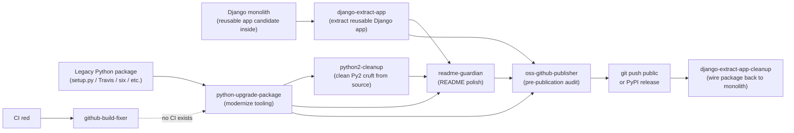

# claude-skills

A collection of [Claude Code](https://docs.anthropic.com/en/docs/claude-code) skills for Python, DevOps, code review, and decision-making workflows, distributed as a plugin marketplace.

## Available Plugins

Grouped by purpose:

### Python project lifecycle

| Plugin | Description |
|--------|-------------|
| [python-upgrade-package](plugins/python-upgrade-package/) | Modernizes legacy Python packages step-by-step — `setup.py` → `uv` + `pyproject.toml`, Travis → GitHub Actions, pytest migration |
| [python2-cleanup](plugins/python2-cleanup/) | Removes Python 2 compatibility cruft from a Py3 codebase — `six`, `__future__`, `unicode()`, `iteritems`, `python_2_unicode_compatible`, etc. — one commit per category |
| [django-extract-app](plugins/django-extract-app/) | Audits a Django app inside a monolithic project for extractability (cross-app FKs, imports, settings, migration deps, URL/signal coupling) and extracts it into a standalone reusable Django package with tests, CI, pre-commit, and optional example project. Includes a separate cleanup sub-skill for wiring the package back into the original project |
| [readme-guardian](plugins/readme-guardian/) | Analyzes and improves Python project READMEs — badges, install instructions, Python/Django version support matrix (canonical source for Django × Python compatibility) |
| [oss-github-publisher](plugins/oss-github-publisher/) | Pre-flight audit before publishing a repo as open source — LICENSE, CI, pre-commit, secrets/PII/internal-hostname scans, GitHub Actions security, PyPI metadata audit |
| [github-build-fixer](plugins/github-build-fixer/) | Diagnoses and fixes failing GitHub Actions CI builds — reads logs, proposes fixes, pushes, polls until green |

### Code quality & refactoring

| Plugin | Description |
|--------|-------------|
| [long-file-splitter](plugins/long-file-splitter/) | Scans a repo for source files over a line threshold (default 600 LoC) in Python, JavaScript/TypeScript, HTML, Vue/Svelte — and for files dominated by a single mega-constant. Classifies each file (grab-bag utils / god-class / mega-constant / mixed) and writes a per-file split proposal with concrete module names, what moves where, public-API preservation strategy, and risks. Proposal-first; optional guided execution one file at a time, one commit per logical move, tests after each |

### Decision-making (premortems)

| Plugin | Description |
|--------|-------------|
| [premortem](plugins/premortem/) | Klein-style premortem on plans, launches, hires, pricing, or strategy — assumes failure 6 months out and works backward; produces visual HTML report |

### Support / ops (iplweb-specific)

| Plugin | Description |
|--------|-------------|
| [freshdesk](plugins/freshdesk/) | Review of pending Freshdesk tickets (iplweb) — ranks by composite priority (SLA → due date → priority → age), shows a readable list and drives action (open, show conversation, change status/priority, draft a reply). Companion to `ticket-resolver`. |
| [ticket-resolver](plugins/ticket-resolver/) | Handles a **single** ticket (Freshdesk or GitHub issue) end-to-end — triage (explain vs fix), draft a client reply for approval, or branch + worktree + TDD repro test + fix + PR + towncrier newsfragment, with internal trace notes. |

> These two hardcode the iplweb Freshdesk account and the `iplweb/bpp` repo — they live here for versioning/reuse, not as general reusable tools.

### Extras (not plugins)

| Tool | Description |
|------|-------------|
| [statusline](statusline/) | `statusLine` script for Claude Code — shows `user@host`, `~/path`, git branch, % of 5h billing block used (via [ccusage](https://github.com/ryoppippi/ccusage)), and % of weekly token budget. Tuned for light terminal themes. |

## Skill graph — when to use what

### Python project lifecycle



**Recommended sequence** for modernizing + open-sourcing a legacy Python package:

1. `python-upgrade-package` — packaging, CI, pre-commit, pytest. Tooling only, never touches source.
2. `python2-cleanup` — clean Py2 cruft from source if any (`six`, `__future__`, `unicode()`, etc.). One commit per category.
3. `readme-guardian` — RST → MD, badges, install instructions, Python/Django version matrix.
4. `oss-github-publisher` — last-mile audit (LICENSE, secrets, internal hostnames, PyPI metadata, GH Actions security).
5. Publish.
6. If CI fails along the way, `github-build-fixer` diagnoses and fixes.

**Recommended sequence** for extracting a reusable Django app from a monolithic project:

1. `django-extract-app` — audit the app (8-point extractability check), then scaffold a standalone package with tests + CI + pre-commit + optional example project. Chains into `readme-guardian` and `oss-github-publisher` at the end.
2. Publish the new package (PyPI, private index, or keep as editable install).
3. `django-extract-app-cleanup` — wire the new package into the monolith as a dependency and remove the original `<app>/` directory. Verifies `manage.py check` + `makemigrations --check --dry-run` + the monolith's tests still pass.

### Decision-making

`/premortem` runs a Klein-style premortem on a plan, launch, hire, pricing, or strategy — a single conversational perspective that assumes failure six months out and works backward, producing a visual HTML report. Use it to stress-test a decision by imagining it has already failed.

### Cross-references between skills

- `python-upgrade-package` reads its Django × Python compatibility matrix from `readme-guardian` (single source of truth — see Step 2b in `python-upgrade-package`).
- `python-upgrade-package` recommends `python2-cleanup` after Step 6 (modernize tooling first, then clean Py2 cruft from source — different scopes, different Iron Laws).
- `readme-guardian` recommends running `python-upgrade-package` first when the project has legacy tooling — fixing the README without fixing the underlying `pyproject.toml` produces inconsistent badges.
- `oss-github-publisher` recommends `readme-guardian` for README polish (audit will WARN on missing sections; readme-guardian fixes them properly).
- `github-build-fixer` suggests `python-upgrade-package` when no CI workflow exists — fixing absent CI is a packaging-modernization concern, not a build-fixer one.
- `django-extract-app` derives its Django × Python CI matrix from `readme-guardian` (same single source of truth as `python-upgrade-package`), and chains into `readme-guardian` + `oss-github-publisher` as the last two steps of an extraction. Its phase-2 sub-skill `django-extract-app-cleanup` is invoked separately after the extracted package is published.

## Installation

### Step 1: Add the marketplace

In Claude Code, run:

```
/plugin marketplace add iplweb/claude-skills
```

### Step 2: Install the plugins you want

```
/plugin install django-extract-app@iplweb-claude-skills
/plugin install github-build-fixer@iplweb-claude-skills
/plugin install long-file-splitter@iplweb-claude-skills
/plugin install oss-github-publisher@iplweb-claude-skills
/plugin install premortem@iplweb-claude-skills
/plugin install python-upgrade-package@iplweb-claude-skills
/plugin install python2-cleanup@iplweb-claude-skills
/plugin install readme-guardian@iplweb-claude-skills
```

Install only the ones you need — each plugin is independent.

## Usage

Once installed, skills activate automatically based on context, or you can invoke them explicitly:

- `/django-extract-app:django-extract-app` — extract a Django app from a monolithic project into a standalone reusable package (audit + scaffold + chain into readme-guardian + oss-github-publisher)
  - `/django-extract-app:django-extract-app-cleanup` — phase-2 sub-skill: wire the new package back into the monolith and remove the original app directory
- `/github-build-fixer:github-build-fixer` — when CI is failing on your branch
- `/long-file-splitter:long-file-splitter` — find source files over a line threshold and get a per-file split proposal (Python / JS / TS / HTML / Vue / Svelte); proposal-first, optional guided execution
- `/oss-github-publisher:oss-github-publisher` — before publishing a repo as open source
- `/premortem:premortem` — to stress-test a plan, launch, or decision by imagining it has already failed
- `/python-upgrade-package:python-upgrade-package` — to modernize a legacy Python package (tooling only)
- `/python2-cleanup:python2-cleanup` — to remove Python 2 compatibility cruft from a Py3 codebase (source code, category by category)
- `/readme-guardian:readme-guardian` — to improve a project's README

## Using with Codex

These skill folders can be used directly with Codex because each one contains a `SKILL.md` file. Codex discovers user-installed skills from `$CODEX_HOME/skills`; if `CODEX_HOME` is not set, that defaults to `~/.codex/skills`.

Symlink the skill you want into Codex's skills directory:

```bash
mkdir -p "${CODEX_HOME:-$HOME/.codex}/skills"
ln -s "$(pwd)/plugins/<plugin>/skills/<skill-name>" \
  "${CODEX_HOME:-$HOME/.codex}/skills/<skill-name>"
```

For example:

```bash
ln -s "$(pwd)/plugins/readme-guardian/skills/readme-guardian" \
  "${CODEX_HOME:-$HOME/.codex}/skills/readme-guardian"
```

### Quick setup (all skills, global)

```bash
mkdir -p "${CODEX_HOME:-$HOME/.codex}/skills"
for dir in plugins/*/skills/*/; do
  skill=$(basename "$dir")
  ln -sfn "$(pwd)/$dir" "${CODEX_HOME:-$HOME/.codex}/skills/$skill"
done
```

Restart Codex after linking so it reloads the skill metadata.

Once installed, invoke a skill by naming it in your prompt, for example:

```text
Use the readme-guardian skill to improve this project's README.
Use the python-upgrade-package skill to modernize this package.
```

In Codex interfaces that support explicit skill mentions, you can also reference the skill directly, for example `$readme-guardian`.

The Claude Code slash-command forms above, such as `/readme-guardian:readme-guardian`, are Claude Code commands. In Codex, use natural-language skill names or explicit skill mentions instead.

## Using with OpenCode

These skills also work with [OpenCode](https://opencode.ai). OpenCode discovers skills from specific directories — symlink each skill folder into a discoverable location:

```bash
# Global (available in all projects)
ln -s "$(pwd)/plugins/<plugin>/skills/<skill-name>" \
  ~/.config/opencode/skills/<skill-name>

# Or per-project
ln -s "$(pwd)/plugins/<plugin>/skills/<skill-name>" \
  .opencode/skills/<skill-name>
```

OpenCode scans these paths for `SKILL.md` files:

| Location | Scope |
|----------|-------|
| `.opencode/skills/<name>/SKILL.md` | Project |
| `~/.config/opencode/skills/<name>/SKILL.md` | Global |
| `.claude/skills/<name>/SKILL.md` | Project (Claude-compatible) |
| `~/.claude/skills/<name>/SKILL.md` | Global (Claude-compatible) |
| `.agents/skills/<name>/SKILL.md` | Project |
| `~/.agents/skills/<name>/SKILL.md` | Global |

### Quick setup (all skills, global)

```bash
mkdir -p ~/.config/opencode/skills
for dir in plugins/*/skills/*/; do
  skill=$(basename "$dir")
  ln -sf "$(pwd)/$dir" ~/.config/opencode/skills/"$skill"
done
```

After linking, OpenCode will list the skills in the `skill` tool and agents can load them on demand. See the [OpenCode skills docs](https://opencode.ai/docs/skills/) for details.

## Versioning

This marketplace uses [CalVer](https://calver.org/) — `YYYY.0M.MICRO` (e.g. `2026.05.0`, `2026.05.1`, `2026.06.0`).

- `YYYY` — full year
- `0M` — zero-padded month (01–12)
- `MICRO` — release counter within the month, starting at 0

All plugins ship in **lockstep**: every release re-tags every plugin and the marketplace itself with the same version. There are no per-plugin version trains — if any plugin changes, the next release bumps everything.

Current version: see [`CHANGELOG.md`](CHANGELOG.md) for the release history. To cut a release run `scripts/bump-version.sh <YYYY.0M.MICRO>` (or `--auto` for the next sensible value).

## Adding plugins & validation

See [`CONTRIBUTING.md`](CONTRIBUTING.md) for the full layout and invariants. In short:

```bash
python3 scripts/new-plugin.py my-plugin "One-line description."   # scaffold
python3 scripts/validate.py                                       # check invariants
pre-commit run --all-files                                        # json + whitespace + validate
```

`scripts/validate.py` enforces the marketplace invariants (name == directory == entry, lockstep versions, marketplace ↔ `plugins/` in sync, every `SKILL.md` has `name`/`description` front matter) and runs in CI on every push/PR via [`.github/workflows/validate.yml`](.github/workflows/validate.yml).

## License

MIT — see [LICENSE](LICENSE) for details.
