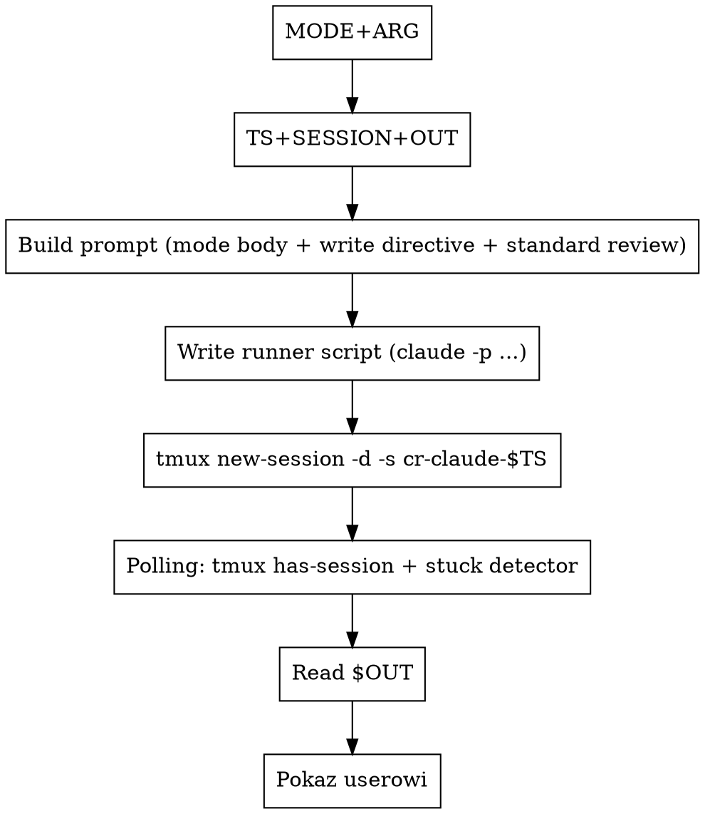

# Code review przez headless Claude w tmux

## Kiedy używać

- User uruchamia `/code-review-claude [target]`.
- User wprost prosi o "lokalny review przez claude'a", "trzecią
  opinię od claude'a".
- W ramach `code-review-external` (równolegle do codex/opencode,
  każdy w swojej tmux session).

NIE używaj, gdy:
- Cel to **PR na GitHubie** → użyj `/code-review:code-review`,
  ten skill jest tam grubo lepszy (multi-agent pipeline + scoring +
  posting komentarza).
- User chce review zrobione „w trybie konwersacji" przez Ciebie
  bezpośrednio - po prostu zrób review w main agencie zamiast
  spawnować osobnego Claude'a. Ten skill ma sens dla równoległości
  z innymi narzędziami albo izolacji kontekstu / audit trail
  (sesja tmux jest niezależna i atachable).

## Wymagania

- `claude` w `$PATH` (sprawdź: `which claude && claude --version`).
  W tym pluginie znaczy "Claude Code CLI" (https://claude.ai/code).
- `tmux` w `$PATH`. Cały skill jedzie przez tmux — patrz
  `../../shared/tmux-runner.md`.
- Skonfigurowany auth (OAuth lub `ANTHROPIC_API_KEY`). Jeśli
  zewnętrzny `claude -p` nie potrafi się zauthnąć (np. user kasuje
  cache OAuth), skill wybuchnie szybko — stuck detector w 90s.

## Auto-detekcja celu (z argumentu usera)

Wspólna logika 5 trybów (`uncommitted` / `file` / `dir` / `commit` / `free`) —
czytaj **`../../shared/target-detection.md`**. Zastosuj wzór i **zawsze
ogłoś userowi** wykryty tryb zanim odpalisz tmux session.

## Mechanizm: `claude -p` headless w tmux session

W przeciwieństwie do starego wzorca (`Agent` tool dispatchuje subagenta
w tym samym procesie Claude'a), nowy wzorzec uruchamia **osobny proces
`claude -p`** w tmux. Korzyści:

- **Attachable terminal** — `tmux attach -t cr-claude-$TS` pokazuje
  na żywo co Claude robi, identycznie jak codex/opencode.
- **Audit trail** — pełen zapis pane'a w RUN_LOG, niezależny od
  wewnętrznego state główncj sesji.
- **Spójność z innymi reviewerami** — `code-review-external` widzi
  3 sesje tmux równolegle, attachowalne, z tym samym lifecycle.
- **Niezależny kontekst** — proces `claude -p` ma czysty start, nie
  dziedziczy konwersacji ani CLAUDE.md memory z głównego agenta
  (tylko `--add-dir` i flagi które jawnie ustawisz).



## Claude-specific runner line

Linia w runner script (KROK 3 wzorca z `tmux-runner.md`):

```bash
printf 'claude -p %q --permission-mode auto --add-dir /tmp --add-dir %q --allowedTools %q --output-format text </dev/null\n' \
  "$PROMPT_TEXT" "$PROJECT_ROOT" "Read Grep Glob Bash Write Edit"
```

Flagi:
- `-p` / `--print` — non-interactive single response mode (zamiast TUI).
- `--permission-mode auto` — pozwala czytać projekt + zapis do `/tmp`,
  bez interaktywnych pytań permission. Bezpieczniejsza alternatywa
  niż `--dangerously-skip-permissions`.
- `--add-dir /tmp` — daje Claude'owi dostęp do `/tmp/` (potrzebne
  żeby zapisać OUT przez Write tool).
- `--add-dir "$PROJECT_ROOT"` — explicit dostęp do projektu (gdy
  cwd = home albo inne, claude domyślnie tylko widzi cwd).
- `--allowedTools "Read Grep Glob Bash Write Edit"` — minimalne narzędzia
  potrzebne do review. Bez `Task` (żadnych subagentów dla
  deterministyczności), bez `WebFetch/WebSearch` (offline review),
  bez `mcp__*` (skill ma być portable).
- `--output-format text` — czysty tekst na stdout (dyrektywa zapisu
  i tak każe pisać do pliku OUT, więc stdout to tylko backup).
- `</dev/null` — zamyka stdin żeby Claude nie czekał na input
  interaktywny gdy auto mode w sandbox bash potrzebowałby zgody.

## Tryb-specyficzny prompt body (5 wariantów)

Wstaw w `PROMPT_TEXT` w miejsce body. Reszta (dyrektywa zapisu +
standardowy prompt review) jest wspólna.

### `uncommitted` (wymaga git repo)

Preflight: `git rev-parse --is-inside-work-tree >/dev/null 2>&1`.
Brak → stop, "ten tryb wymaga git repo". Body:

```
Zrób code review niezacommitowanych zmian w tym repo. Zacznij
od `git diff HEAD` (staged + unstaged) oraz
`git ls-files --others --exclude-standard` (untracked). Dla
każdego untracked - przeczytaj plik w całości.
```

### `commit` (wymaga git repo)

Body:

```
Zrób code review commita **${ARG}**. Zacznij od `git show ${ARG}`
żeby zobaczyć diff i metadane. Jeśli widzisz refaktor — sprawdź
że zachowanie jest tożsame.
```

### `file` (działa w git i nie-git)

Body:

```
Zrób code review pliku **${ARG}**. Przeczytaj plik w całości
i oceń jakość kodu, nie tylko ostatnich zmian. Jeśli widzisz
funkcje publiczne — sprawdź że wywołania w innych miejscach
repo są zgodne (`grep` po nazwie).
```

### `dir` (działa w git i nie-git)

Body:

```
Zrób code review katalogu **${ARG}**. Wylistuj zawartość
(`git ls-files ${ARG}` jeśli git, inaczej `find`), przeczytaj
kluczowe pliki. Pomiń testy chyba że widzisz w nich błędy.
```

### `free` (działa w git i nie-git)

Body:

```
User prosi o następujące code review tego repo:

  ${ARG}

Sam zorientuj się co dokładnie zreviewować i jak (które pliki,
które komendy git, ewentualnie cały repo). Trzymaj się tematu
i scope-u który user wskazał — jeśli mówi "security audit",
nie rób ogólnego review; jeśli mówi "całe repo", przejrzyj
ważne moduły (Read/Grep/Bash dostępne), nie tylko ostatnie
zmiany; jeśli mówi "przejrzyj SPEC.md", oceniaj ten dokument
jak design doc (spójność, kompletność, dziury w wymaganiach), nie kod.
```

## Złożenie pełnego prompta

`PROMPT_TEXT` = konkatenacja:

1. **Tryb-specyficzne body** (z sekcji wyżej, z interpolacją `${ARG}`).
2. **Dyrektywa zapisu** — czytaj `../../shared/write-directive.md`,
   wstaw 1:1. `${OUT}` w treści MUSI być zinterpolowane przez shell
   (HEREDOC bez apostrofów wokół delimitera) zanim trafi do runnera.
3. **Standardowy prompt review** — czytaj `../../shared/standard-review-prompt.md`,
   wstaw 1:1.

Edytujesz wspólne pliki raz — trzy leafy + wrapper używają tej samej
wersji.

## Pełny wrapper bash

Cały setup + dispatch + polling w **jednej** komendzie bash (timeout
600000 ms). Patrz `../../shared/tmux-runner.md` dla pełnego wzorca
(KROK 1 preflight, KROK 2 build prompt, KROK 3 runner script,
KROK 4 tmux launch, polling). Claude-specific to tylko linia w
runnerze (powyżej, "Claude-specific runner line").

## Po wykonaniu

1. Sesja `cr-claude-$TS` zamyka się sama gdy `claude -p` zwróci.
2. `wc -c "$OUT"`. Brak / pusty → tail RUN_LOG (`tail -30 "$RUN_LOG"`)
   pokaże dlaczego (auth error, sandbox denial, permission ask, etc.).
3. Sensowny rozmiar (>200 B) → `Read "$OUT"`.
4. Powiedz userowi krótko: "Claude review w `$OUT`. Sesja zakończona,
   log: `$RUN_LOG`."
5. Wywołane przez `code-review-external` → wrapper sam czyta i renderuje.
6. Standalone → pokaż zawartość `$OUT` raz.

## Częste pomyłki

- **Użycie `Agent` tool zamiast `claude -p` w tmux** — stary wzorzec.
  Tracimy: attach UX, niezależny audit trail, spójność z codex/opencode
  w `code-review-external`. Nowy wzorzec to tmux session — bez wyjątków.
- **Pominięcie `--add-dir /tmp`** — Claude domyślnie ma dostęp tylko
  do cwd. Bez `--add-dir /tmp` Write do `${OUT}` zostanie odrzucone
  permission'em.
- **Pominięcie `--add-dir "$PROJECT_ROOT"`** — jeśli odpalasz z innego
  cwd niż project root (np. z home), claude nie zobaczy plików projektu.
- **`--dangerously-skip-permissions`** — niepotrzebne. `--permission-mode auto`
  + odpowiednie `--add-dir` wystarczy. Skip-permissions otwiera dziurę
  bezpieczeństwa.
- **Pominięcie `--allowedTools`** — domyślnie claude ma wszystkie tools,
  w tym `Task` (subagenty), `WebFetch`. Dla deterministyczności review
  ogranicz do `Read Grep Glob Bash Write Edit`.
- **Pominięcie dyrektywy zapisu w prompcie** — claude wyrzuci review na
  stdout, plik OUT nie powstanie. Dyrektywa zapisu jest **obowiązkowa**.
- **`${OUT}` nie zinterpolowane w prompcie** — claude dostaje literalny
  string, jeśli `${OUT}` nie zostanie podstawione przed runnerem,
  claude napisze do literalnej ścieżki `${OUT}` lub potraktuje to jako
  placeholder i zignoruje. Sprawdź na oko że w prompcie jest
  `/tmp/code-review-claude-<TS>.md`, nie `${OUT}`.
- **Pominięcie tmux** — odpalanie `claude -p ... > $RUN_LOG 2>&1`
  bezpośrednio. Tracimy attach UX i live observability. ZAWSZE w tmux.
- **Wywoływanie skilla dla PR-a na GitHubie** — ma własny skill
  (`/code-review:code-review`) z multi-agent pipeline i scoring,
  tam jest grubo lepszy. Ten skill ma sens dla LOKALNYCH targetów.
- **Stuck threshold za krótki** — claude cold start + auth check +
  initial reasoning = łatwo 30-60s przed pierwszym output. **90s** to
  dobre minimum. Krócej → false-aborty.
