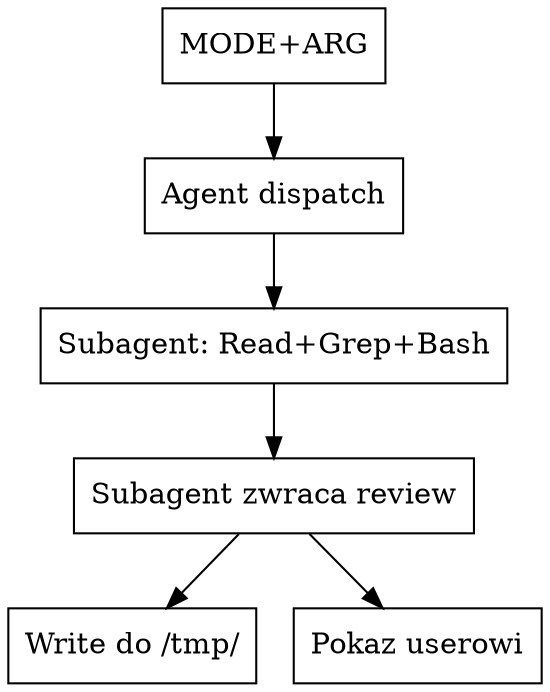

# Code review przez subagenta Claude

## Kiedy używać

- User uruchamia `/code-review-claude [target]`.
- User wprost prosi o "lokalny review przez claude'a", "trzecią
  opinię od claude'a".
- W ramach `code-review-external` (równolegle do codex/opencode).

NIE używaj, gdy:
- Cel to **PR na GitHubie** → użyj `/code-review:code-review`,
  ten skill jest tam grubo lepszy (5 paralelnych Sonnet agentów,
  scoring, eligibility check, posting komentarza).
- User chce review zrobione „w trybie konwersacji" przez Ciebie
  bezpośrednio - po prostu zrób review w main agencie zamiast
  dispatchować subagenta. Ten skill ma sens dla równoległości
  z innymi narzędziami albo izolacji kontekstu.

## Auto-detekcja celu (z argumentu usera)

Identyczna jak w `code-review-codex` / `code-review-opencode`:

1. **Brak argumentu** → `uncommitted` (staged + unstaged + untracked).
2. **`test -f "$ARG"`** zwraca true → `file`.
3. **`test -d "$ARG"`** zwraca true → `dir`.
4. **`git rev-parse --verify "$ARG^{commit}"`** zwraca 0 → `commit`.
5. **W przeciwnym razie → `free`** (free-form hint). Argument jest
   wolnym tekstem od usera ("całe repo", "audyt security w
   `src/auth/`") — przekazujemy go do subagenta jako wskazówkę,
   subagent sam decyduje co przejrzeć.

Po detekcji **zawsze ogłoś userowi** jednym zdaniem ("Tryb: free,
wskazówka: ‘…’"), żeby mógł przerwać przy typo.

## Mechanizm: subagent przez `Agent` tool

Zamiast CLI wywołujesz **`Agent` tool** z `subagent_type:
"general-purpose"`. Subagent dostaje pełny prompt z review
instructions i robi swoje przy użyciu Read/Grep/Bash.

Po zwróceniu wyniku przez agenta:
1. Pokaż wynik userowi (chyba że wywołany przez wrapper).
2. **Zapisz** wynik do `/tmp/code-review-claude-<TS>.md` przez
   `Write` tool (subagent nie zapisuje - tylko zwraca tekst).



## Prompt subagenta (kompletny - skopiuj 1:1)

Dispatchuj `Agent` z `subagent_type: "general-purpose"`,
`description: "Code review (claude, <mode>)"`, i `prompt`
zbudowanym z **dwóch części**:

**Część A: kontekst targetu** - zależnie od MODE:

- `uncommitted`:
  > Zrób code review niezacommitowanych zmian w tym repo. Zacznij
  > od `git diff HEAD` (staged + unstaged) oraz
  > `git ls-files --others --exclude-standard` (untracked). Dla
  > każdego untracked - przeczytaj plik w całości.

- `commit <SHA>`:
  > Zrób code review commita **`<SHA>`**. Zacznij od `git show <SHA>`
  > żeby zobaczyć diff i metadane. Jeśli widzisz refaktor - sprawdź
  > że zachowanie jest tożsame.

- `file <PATH>`:
  > Zrób code review pliku **`<PATH>`**. Przeczytaj plik w całości
  > i oceń jakość kodu, nie tylko ostatnich zmian. Jeśli widzisz
  > funkcje publiczne - sprawdź że wywołania w innych miejscach
  > repo są zgodne (`grep` po nazwie).

- `dir <PATH>`:
  > Zrób code review katalogu **`<PATH>`**. Wylistuj zawartość
  > (`git ls-files <PATH>` jeśli git, inaczej `find`), przeczytaj
  > kluczowe pliki. Pomiń testy chyba że widzisz w nich błędy.

- `free <HINT>`:
  > User prosi o następujące code review tego repo:
  >
  >   `<HINT>`
  >
  > Sam zorientuj się co dokładnie zreviewować i jak (które pliki,
  > które komendy git, ewentualnie cały repo). Trzymaj się tematu
  > i scope-u który user wskazał — jeśli mówi "security audit",
  > nie rób ogólnego review; jeśli mówi "całe repo", przejrzyj
  > ważne moduły (Read/Grep/Bash dostępne), nie tylko ostatnie
  > zmiany.

**Część B: standardowy review block** - dosłownie:

```
Pisz po polsku. Senior reviewer, konkret nie ogólnik.

KONTEKST PROJEKTU:
- **NAJPIERW** zorientuj się jaki to projekt: jakim językiem pisany,
  jakim frameworkiem, gdzie testy. Wykryj sam (po plikach typu
  `pyproject.toml`, `package.json`, `Cargo.toml`, `go.mod`).
- **POTEM przeczytaj `CLAUDE.md` w korzeniu repo** oraz każdy inny
  `CLAUDE.md` znaleziony w katalogach zmienionych w tym diff/commit/
  pliku/katalogu (twarde reguły konkretnego projektu - zakazy
  formatowania, wymagania exception handling, zakaz modyfikowania
  migracji, wymagane prefiksy komend, itp.).
- Złamanie reguły z CLAUDE.md → automatycznie score ≥ 75 i cytuj
  którą regułę złamano.
- Spójność z konwencjami sąsiedniego kodu liczy się tak samo jak
  reguły explicit.

CO ZGŁOSIĆ (tylko realne problemy):
- Bugi i błędy logiczne (off-by-one, błędne warunki, race conditions,
  leak zasobów, zły lifecycle).
- Luki bezpieczeństwa: SQL injection, XSS, CSRF, command injection,
  path traversal, IDOR, niebezpieczne deserializacje, brakujące
  permissions, sekrety w logach/responsach, GET-y mutujące stan.
- Złamanie konkretnej reguły z CLAUDE.md (cytuj którą).
- Połknięte wyjątki bez logu/re-raise (`except: pass`,
  `catch (e) {}`, etc.) - prawie zawsze błąd.
- Brakujące walidacje input-u na granicy systemu.
- Framework-specific anti-patterny (np. Django: N+1, brak
  `select_related`, niezweryfikowane permissions; React: brak
  deps w `useEffect`, mutacja state - dobierz wg języka).
- Brak testów dla **nowej** krytycznej ścieżki, jeśli reszta repo
  testy pisze.

CO BEZWZGLĘDNIE POMIJAĆ (false positives - score 0):
- Pre-existing issues (problem był przed tą zmianą).
- Problemy na liniach **nie zmodyfikowanych** w tym diff/commit
  (NIE dotyczy trybu file/dir - tam review całości jest sensem).
- Cokolwiek co łapie linter/typechecker/CI: formatowanie, długość
  linii, importy, type errors, broken tests.
- Subiektywne preferencje stylu nie wymienione w CLAUDE.md.
- "Dodaj docstring/type hints" jeśli reszta repo ich nie ma.
- Issue explicit-em wyciszony w kodzie (`# noqa`, `# type: ignore`,
  `eslint-disable`).
- Zmiany funkcjonalności intencjonalne / część szerszej zmiany.
- Generic "lack of test coverage / poor documentation" - tylko
  jeśli CLAUDE.md tego wymaga.

CONFIDENCE SCORING (0-100), ZGŁASZAJ TYLKO ≥ 80:
- 0: FP, nie wytrzyma lekkiej krytyki, lub pre-existing.
- 25: może realny, może FP - nie potwierdzony.
- 50: potwierdzony, ale nitpick / rzadki w praktyce.
- 75: ważny, na pewno wystąpi w praktyce, lub explicit w CLAUDE.md.
- 100: pewny, częsty, dowody wprost w kodzie.

Każda zgłoszona uwaga MUSI mieć:
- **`<plik>:<linia>`** - bez tego nie zgłaszaj.
- Cytat fragmentu (max 5 linii) jeśli pomaga.
- Sugestia naprawy w 1-2 zdaniach.
- Cytat reguły z CLAUDE.md jeśli to compliance issue.

ZWRÓĆ ODPOWIEDŹ JAKO MARKDOWN (po polsku):

## Podsumowanie
2-3 zdania: ogólna ocena + verdykt
(gotowe do merge / wymaga drobnych zmian / blokery).

## Uwagi (tylko score ≥ 80)

### 🔴 CRITICAL (blokery, score 100)
### 🟠 HIGH (fix przed merge, score 90-99)
### 🟡 MEDIUM (warto poprawić, score 80-89)

W każdej sekcji lista, każda uwaga w formacie wyżej.
Sekcja pusta → "brak".

Jeśli wszystkie sekcje puste → napisz wprost: "Nie znalazłem realnych
problemów score ≥ 80." Nie dorabiaj uwag żeby coś zgłosić.

NIE pisz preambuły o tym co zaraz zrobisz, NIE podsumowuj na koniec
„zakończyłem review" - main agent dostaje twój output 1:1, więc
zwróć tylko sam markdown review.
```

## Po wykonaniu

1. Po zwróceniu treści przez `Agent`, zapisz **dokładnie** ten tekst
   do `/tmp/code-review-claude-$TS.md` przez `Write` tool. (Nazwa
   z tym samym `$TS` co w wrapperze, jeśli wywołany przez wrapper -
   timestamp przekazany jako kontekst).
2. Pokaż userowi review (cały tekst zwrócony przez agenta), chyba
   że wywołany przez `code-review-external` - wtedy nie drukuj,
   wrapper sam to złoży.
3. Powiedz userowi 1 zdaniem: "Claude review zapisany w
   `$OUT_PATH`."

## Częste pomyłki

- **Nie używanie subagenta tylko sam main agent.** Sens skilla =
  oddzielny kontekst (subagent nie ma śmieci z konwersacji)
  + równoległe wykonanie z codex/opencode w wrapperze. Robienie
  review w main agencie unieważnia oba te zyski.
- **Inny `subagent_type` niż `general-purpose`.** Niektóre wyspecjalizowane
  agenty (np. `feature-dev:code-reviewer`) wyglądają kuszące, ale są
  pluginowo-zależne i mogą nie istnieć na innej maszynie. `general-purpose`
  z dobrym promptem jest portable. Jeśli mocno zależy ci na
  `feature-dev:code-reviewer` - użyj go, ale wiedz, że skill staje
  się zależny od pluginu.
- **Pominięcie `Write` po dispatchu.** Subagent zwraca tekst do
  Ciebie, nie zapisuje pliku sam. Bez `Write` user nie ma artefaktu
  do późniejszego cytowania.
- **Modyfikacja review w drodze do pliku.** Zapisz **dosłownie**
  to co zwrócił subagent, bez parafraz, bez dodatkowych wstępów.
- **Wywoływanie skilla dla PR-a na GitHubie.** Ma własny skill
  (`/code-review:code-review`) z multi-agent pipeline i scoring -
  tam jest grubo lepszy. Ten skill ma sens dla LOKALNYCH targetów.
