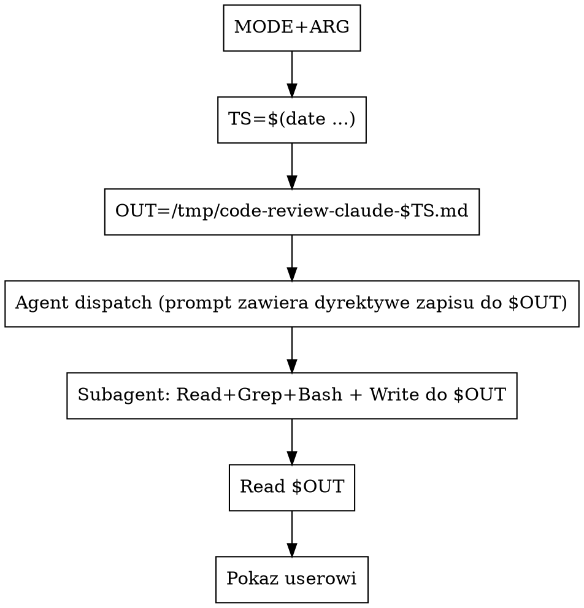

# Code review przez subagenta Claude

## Kiedy używać

- User uruchamia `/code-review-claude [target]`.
- User wprost prosi o "lokalny review przez claude'a", "trzecią
  opinię od claude'a".
- W ramach `code-review-external` (równolegle do codex/opencode).

NIE używaj, gdy:
- Cel to **PR na GitHubie** → użyj `/code-review:code-review`,
  ten skill jest tam grubo lepszy (5 paralelnych Sonnet agentów,
  scoring, eligibility check, posting komentarza).
- User chce review zrobione „w trybie konwersacji" przez Ciebie
  bezpośrednio - po prostu zrób review w main agencie zamiast
  dispatchować subagenta. Ten skill ma sens dla równoległości
  z innymi narzędziami albo izolacji kontekstu.

## Auto-detekcja celu (z argumentu usera)

Wspólna logika 5 trybów (`uncommitted` / `file` / `dir` / `commit` / `free`) — czytaj **`../../shared/target-detection.md`**. Zastosuj wzór i **zawsze ogłoś userowi** wykryty tryb zanim dispatchujesz subagenta.

## Mechanizm: subagent przez `Agent` tool (artifact-file pattern)

Wywołujesz `Agent` tool z `subagent_type: "general-purpose"`. Subagent dostaje pełny prompt z review instructions + dyrektywę zapisu — robi swoje przy użyciu Read/Grep/Bash, a finalne review pisze **wprost do pliku** przez Write tool (subagent ma Write w domyślnej allowliście). Konsystentnie z codex/opencode w nowym wzorcu.



Przed dispatchem ustal nazwy plików (jeśli nie zostały podane przez wrapper):

```bash
TS=${TS:-$(date +%Y%m%d-%H%M%S)}
OUT=/tmp/code-review-claude-$TS.md
```

`OUT` jest interpolowany do prompta subagenta jako konkretna ścieżka (subagent NIE wykrywa go sam — main agent musi go podstawić w prompt string przed Agent dispatch).

## Prompt subagenta (kompletny - skopiuj 1:1)

Dispatchuj `Agent` z `subagent_type: "general-purpose"`,
`description: "Code review (claude, <mode>)"`, i `prompt`
zbudowanym z **dwóch części**:

**Część A: kontekst targetu** - zależnie od MODE:

- `uncommitted`:
  > Zrób code review niezacommitowanych zmian w tym repo. Zacznij
  > od `git diff HEAD` (staged + unstaged) oraz
  > `git ls-files --others --exclude-standard` (untracked). Dla
  > każdego untracked - przeczytaj plik w całości.

- `commit <SHA>`:
  > Zrób code review commita **`<SHA>`**. Zacznij od `git show <SHA>`
  > żeby zobaczyć diff i metadane. Jeśli widzisz refaktor - sprawdź
  > że zachowanie jest tożsame.

- `file <PATH>`:
  > Zrób code review pliku **`<PATH>`**. Przeczytaj plik w całości
  > i oceń jakość kodu, nie tylko ostatnich zmian. Jeśli widzisz
  > funkcje publiczne - sprawdź że wywołania w innych miejscach
  > repo są zgodne (`grep` po nazwie).

- `dir <PATH>`:
  > Zrób code review katalogu **`<PATH>`**. Wylistuj zawartość
  > (`git ls-files <PATH>` jeśli git, inaczej `find`), przeczytaj
  > kluczowe pliki. Pomiń testy chyba że widzisz w nich błędy.

- `free <HINT>`:
  > User prosi o następujące code review tego repo:
  >
  >   `<HINT>`
  >
  > Sam zorientuj się co dokładnie zreviewować i jak (które pliki,
  > które komendy git, ewentualnie cały repo). Trzymaj się tematu
  > i scope-u który user wskazał — jeśli mówi "security audit",
  > nie rób ogólnego review; jeśli mówi "całe repo", przejrzyj
  > ważne moduły (Read/Grep/Bash dostępne), nie tylko ostatnie
  > zmiany.

**Część B: standardowy blok review (wspólny)** — czytaj **`../../shared/standard-review-prompt.md`** i wstaw zawartość bloku 1:1 jako Część B prompta dla subagenta.

**Część C: dyrektywa zapisu** — czytaj **`../../shared/write-directive.md`** i wstaw zawartość 1:1 (Subagent ma `Write` tool z domyślnej allowlisty `general-purpose`, więc zapisze do `${OUT}` zamiast zwracać tekst). Zmienna `${OUT}` w prompcie subagenta MUSI być przed-podstawiona przez main agent — subagent nie wie sam jaka jest aktualna ścieżka pliku, ty ją wstawiasz w string prompta.

**Łączny prompt subagenta = Część A + B + C**, w tej kolejności.

## Po wykonaniu

1. Sprawdź czy `$OUT` istnieje i ma sensowny rozmiar (`wc -c "$OUT"` ≥ 200 B). Pusty / brak → subagent zignorował dyrektywę zapisu albo padł — pokaż userowi `tail -50` z `Agent` task output żeby zobaczyć dlaczego.
2. Wczytaj `$OUT` przez `Read`.
3. Standalone — pokaż userowi zawartość pliku raz. Wywołany przez `code-review-external` — nie drukuj, wrapper sam to złoży.
4. Powiedz userowi 1 zdaniem: "Claude review zapisany w `$OUT`."

## Częste pomyłki

- **Nie używanie subagenta tylko sam main agent.** Sens skilla =
  oddzielny kontekst (subagent nie ma śmieci z konwersacji)
  + równoległe wykonanie z codex/opencode w wrapperze. Robienie
  review w main agencie unieważnia oba te zyski.
- **Inny `subagent_type` niż `general-purpose`.** Niektóre wyspecjalizowane
  agenty (np. `feature-dev:code-reviewer`) wyglądają kuszące, ale są
  pluginowo-zależne i mogą nie istnieć na innej maszynie. `general-purpose`
  z dobrym promptem jest portable. Jeśli mocno zależy ci na
  `feature-dev:code-reviewer` - użyj go, ale wiedz, że skill staje
  się zależny od pluginu.
- **Pominięcie dyrektywy zapisu w prompcie subagenta.** Subagent w nowym wzorcu **sam pisze** review do `$OUT` przez Write tool. Bez dyrektywy zapisu (Część C, z `shared/write-directive.md`) zwróci tekst zamiast zapisać plik — wrapper czeka na plik, dostanie pusty.
- **`$OUT` nie zinterpolowane w prompcie subagenta.** Subagent dostaje literalny string prompta — main agent musi podstawić aktualną wartość `$OUT` zanim wywoła `Agent`. Sprawdź na oko że ścieżka w prompcie to `/tmp/code-review-claude-<TS>.md`, nie literał `${OUT}`.
- **Wywoływanie skilla dla PR-a na GitHubie.** Ma własny skill
  (`/code-review:code-review`) z multi-agent pipeline i scoring -
  tam jest grubo lepszy. Ten skill ma sens dla LOKALNYCH targetów.
