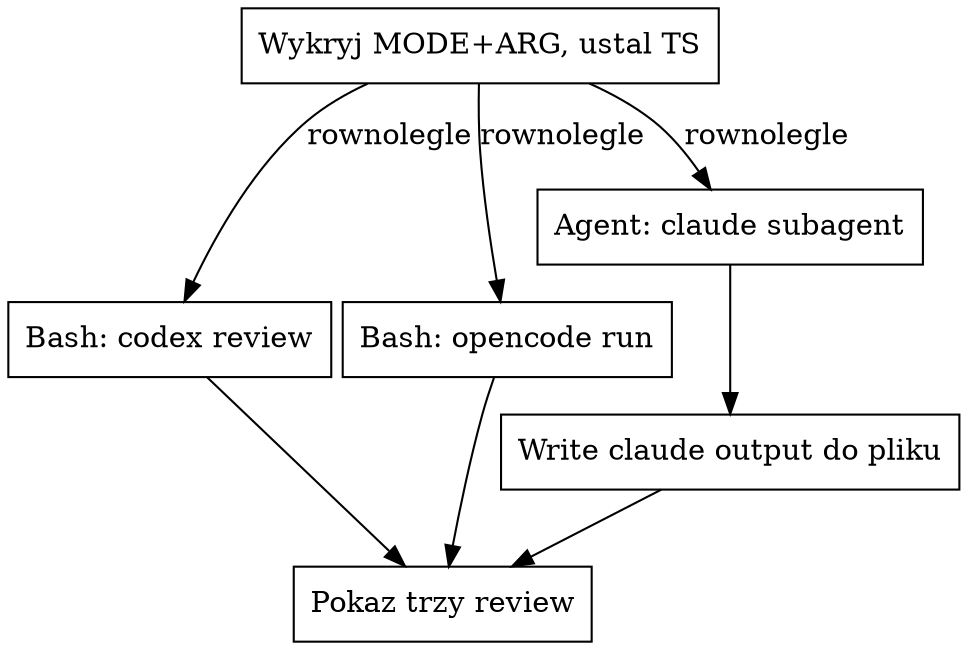

# Równoległe code review: codex + opencode + claude subagent

## Kiedy używać

- User uruchamia `/code-review-external [target]`.
- User prosi o "trzy opinie", "external review", "wszystkie naraz",
  "codex+opencode+claude".

NIE używaj, gdy:
- User chce TYLKO jedno z narzędzi → wywołaj `code-review-codex`,
  `code-review-opencode` albo `code-review-claude` bezpośrednio.
- Cel to PR na GitHubie → `/code-review:code-review` jest tam
  grubo lepszy (multi-agent pipeline + scoring + posting komentarza).

## Wymagania

- **`codex` w `$PATH`** (`which codex`).
- **`opencode` w `$PATH`** (`which opencode`).
- Subagent Claude zawsze dostępny przez `Agent` tool.

Brak któregoś z dwóch CLI → zatrzymaj się i powiedz userowi co
zainstalować. Nie kontynuuj z dwoma, sens skilla = trzy
niezależne opinie. Jeśli user chce tylko 2 z 3, niech użyje
indywidualnych skilli.

## Auto-detekcja celu

Identyczna jak w `code-review-codex` / `code-review-opencode` /
`code-review-claude`:

1. **Brak argumentu** → `uncommitted`.
2. **`test -f "$ARG"`** zwraca true → `file`.
3. **`test -d "$ARG"`** zwraca true → `dir`.
4. **`git rev-parse --verify "$ARG^{commit}"`** zwraca 0 → `commit`.
5. W przeciwnym razie → zatrzymaj się i zapytaj usera.

Wykryj **raz**, użyj tego samego MODE i ARG dla trzech narzędzi.

## Architektura: trzy równoległe wywołania

**Uruchom wszystkie trzy w jednej wiadomości** - tool calls
w tym samym message bloku to równoległe wykonanie. Każde z
osobnym plikiem output, ten sam timestamp.



### Krok 1: ustal nazwy plików (jeden timestamp)

```bash
TS=$(date +%Y%m%d-%H%M%S)
CODEX_OUT=/tmp/code-review-codex-$TS.md
OPENCODE_OUT=/tmp/code-review-opencode-$TS.md
CLAUDE_OUT=/tmp/code-review-claude-$TS.md
```

Wygeneruj `$TS` raz przed dispatchem i podstaw we wszystkich
trzech komendach - inaczej trudno później sparować trójkę plików
tego samego runa.

### Krok 2: trzy równoległe tool calls w jednym message

W **jednej** wiadomości:

1. **`Bash`** (codex) - komenda dosłownie z `code-review-codex`,
   sekcja "Komendy per tryb", odpowiedni MODE. `2>&1 | tee
   "$CODEX_OUT"`, timeout 600000 ms, description: `code review
   codex (<mode>)`.

2. **`Bash`** (opencode) - komenda dosłownie z `code-review-opencode`.
   `2>&1 | tee "$OPENCODE_OUT"`, timeout 600000 ms, description:
   `code review opencode (<mode>)`.

3. **`Agent`** (claude) - dispatch z `subagent_type:
   "general-purpose"`, `description: "code review claude (<mode>)"`,
   `prompt` zbudowany jak w `code-review-claude` (Część A: kontekst
   targetu wg MODE, Część B: standardowy review block).

   **Ważne:** subagent **nie zapisuje pliku**. Po zwrocie tekstu,
   w **następnej** wiadomości użyj `Write` żeby zapisać do
   `$CLAUDE_OUT` 1:1 to co zwrócił agent.

Trzy tool calls w jednym message = wszystkie startują
jednocześnie, czekasz aż ostatni skończy.

### Krok 3: po wszystkich trzech - zapisanie + prezentacja

1. **Zapisz claude review** do `$CLAUDE_OUT` przez `Write` (Bash-e
   już zapisały swoje przez `tee`).

2. **Pokaż userowi trzy review** w stałej kolejności (codex →
   opencode → claude - dla powtarzalności):

```markdown
## 🤖 codex review

[zawartość $CODEX_OUT - zostaw od pierwszego `##` markdown
nagłówka, wytnij banner/log progress codexa]

---

## 🤖 opencode review

[zawartość $OPENCODE_OUT - analogicznie, wytnij ASCII banner]

---

## 🤖 claude review

[zawartość $CLAUDE_OUT - czysta, bez ozdóbek]

---

**Pliki:**
- `$CODEX_OUT`
- `$OPENCODE_OUT`
- `$CLAUDE_OUT`
```

3. **Nie rób syntezy / podsumowania zbiorczego, chyba że user
   o nią poprosi.** Wartość = trzy NIEZALEŻNE opinie. Mieszanie
   ich w jedną gubi rozbieżności, których user chce się
   dowiedzieć (overlap = mocny sygnał, rozbieżność = ciekawe
   miejsce do sprawdzenia).

### Co jeśli któreś narzędzie padło

- `codex` zwrócił non-zero / pusty plik → pokaż dwa pozostałe
  review, dodaj sekcję `⚠️ codex padł - ostatnie linie
  $CODEX_OUT:` z `tail -10 $CODEX_OUT`.
- Analogicznie dla opencode i claude (claude może padnąć jeśli
  subagent zwrócił błąd - wtedy zapis do `$CLAUDE_OUT` może być
  pusty, sprawdź).
- Jeśli padły 2/3 albo 3/3 → nie zgaduj review, raportuj userowi
  co się stało dla każdego z trzech, pokaż ostatnie linie ich
  plików/wyjść. Nie próbuj retry samodzielnie - zapytaj usera.

## Częste pomyłki

- **Sekwencyjne zamiast równoległego wykonania.** Trzy tool calls
  MUSZĄ być w tym samym message bloku. Inaczej ten skill daje
  to samo co odpalenie trzech skilli po kolei - tracimy 2/3
  czasu.
- **Różne timestampy w nazwach plików.** Wygeneruj `$TS` raz
  i podstaw wszędzie. Trzy różne stamps = trudno znaleźć trójkę
  plików tego samego runa.
- **Pominięcie `Write` po Agent dispatch.** Bash-e zapisują przez
  `tee`, ale `Agent` zwraca tylko tekst do main agenta. Bez
  `Write` plik `$CLAUDE_OUT` nie powstanie i wrapper będzie
  niespójny.
- **Synteza/podsumowanie trzech opinii bez prośby.** Wartość
  external review = niezależność. Zlewanie ich w jedno mydli
  rozbieżności.
- **Drukowanie pełnego output codexa/opencode** (ASCII banner,
  logi postępu, "Thinking..."). Wytnij wszystko sprzed pierwszego
  `##` markdown nagłówka - to dopiero sam review.
- **Pominięcie `which codex && which opencode` na starcie.**
  Lepiej powiedzieć od razu zamiast startować dwa i tłumaczyć
  potem dlaczego trzeci nie działa.
- **Zmiana review przy zapisie/displayu.** Pliki + display
  pokazują **dosłownie** to co zwróciły narzędzia. Bez parafraz,
  bez "skróciłem żeby było czytelniej". User chce raw output.
- **Próba użycia `run_in_background=true` dla Bash-ów.** Dla 3
  równoległych tool calls foreground wystarczy. Background
  niepotrzebnie komplikuje (musiałbyś pollować przez
  `BashOutput`). Dwa Bash + jeden Agent w jednym message =
  pełna równoległość, czekasz aż ostatni skończy.
