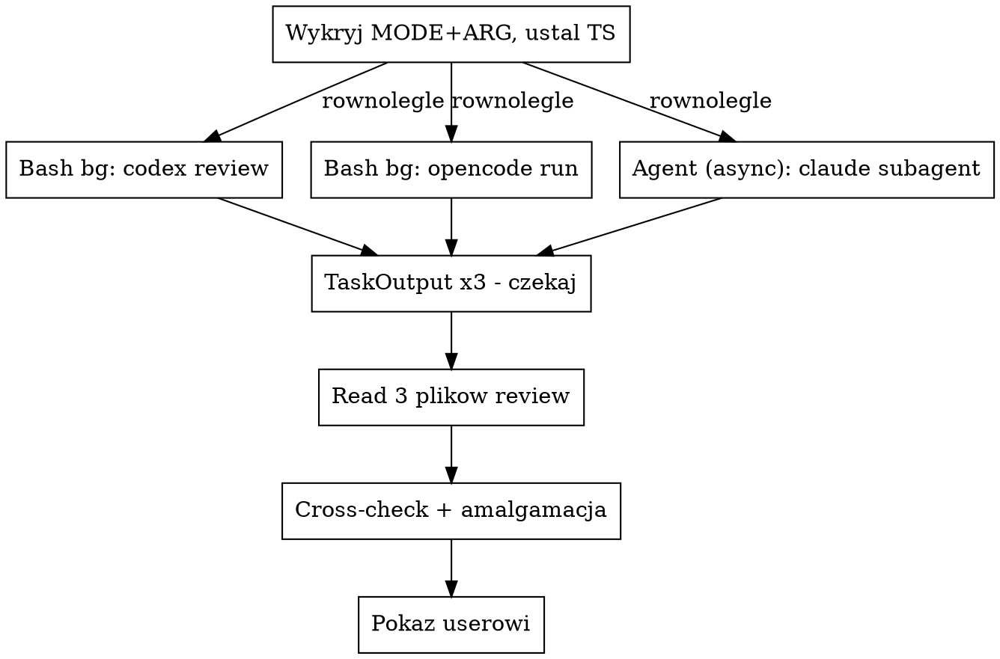

# Równoległe code review: codex + opencode + claude subagent (background + cross-check)

## Kiedy używać

- User uruchamia `/code-review-external [target]`.
- User prosi o "trzy opinie", "external review", "wszystkie naraz",
  "codex+opencode+claude".

NIE używaj, gdy:
- User chce TYLKO jedno z narzędzi → wywołaj `code-review-codex`,
  `code-review-opencode` albo `code-review-claude` bezpośrednio.
- Cel to PR na GitHubie → `/code-review:code-review` jest tam
  grubo lepszy (multi-agent pipeline + scoring + posting komentarza).

## Wymagania

- **`codex` w `$PATH`** (`which codex`).
- **`opencode` w `$PATH`** (`which opencode`).
- Subagent Claude zawsze dostępny przez `Agent` tool.

Brak któregoś z dwóch CLI → zatrzymaj się i powiedz userowi co
zainstalować. Nie kontynuuj z dwoma, sens skilla = trzy
niezależne opinie. Jeśli user chce tylko 2 z 3, niech użyje
indywidualnych skilli.

## Auto-detekcja celu

Wspólna logika 5 trybów (`uncommitted` / `file` / `dir` / `commit` / `free`) — czytaj **`../../shared/target-detection.md`**. Wykryj **raz**, użyj tego samego MODE i ARG dla trzech narzędzi. **Zawsze ogłoś userowi** wykryty tryb zanim odpalisz trzy CLI — przy typo w ścieżce user musi mieć szansę przerwać.

## Architektura: background dispatch → wait → cross-check + amalgamacja

**Wszystkie trzy uruchamiane są w tle**, główny agent czeka na
wszystkie przez `TaskOutput`, dopiero po komplecie produkuje
cross-check i amalgamację. To zasadnicza różnica vs zwykłe odpalenie
trzech skilli — jedno utknięcie (np. opencode wisi 20 min) nie
blokuje pozostałych dwóch i można świadomie podjąć decyzję
"dawaj 2 z 3" zamiast czekać w nieskończoność.



### Krok 1: ustal nazwy plików (jeden timestamp)

```bash
TS=$(date +%Y%m%d-%H%M%S)
CODEX_OUT=/tmp/code-review-codex-$TS.md
OPENCODE_OUT=/tmp/code-review-opencode-$TS.md
CLAUDE_OUT=/tmp/code-review-claude-$TS.md
# verbose logi (debug only) — leaf skille same je tworzą:
# /tmp/code-review-codex-$TS.log
# /tmp/code-review-opencode-$TS.log
```

Wygeneruj `$TS` raz przed dispatchem i wyeksportuj go (`export TS`)
zanim dispatcheszesz Bash-e — leaf skille (`code-review-codex`,
`code-review-opencode`) używają go żeby zachować ten sam timestamp.

### Krok 2: trzy background tool calls w jednym message

W **jednej** wiadomości — tool calls w tym samym message bloku
startują równolegle, a każdy w trybie background nie blokuje
głównego agenta:

1. **`Bash`** (codex) — `run_in_background: true`. Komenda zgodnie
   z `code-review-codex`, sekcja "Komendy per tryb" — **artifact
   file pattern**: codex sam pisze review do `$CODEX_OUT` przez
   swój write tool, stdout/stderr lecą do `/tmp/code-review-codex-$TS.log`.
   Pamiętaj o eksporcie `TS` w komendzie i o **dyrektywie zapisu**
   w prompcie. Timeout 600000 ms. description: `code review codex
   (<mode>)`. Zapamiętaj zwrócony `task_id`.

2. **`Bash`** (opencode) — `run_in_background: true`. Komenda
   zgodnie z `code-review-opencode` — **artifact file + tymczasowy
   project-local config + trap cleanup**. Opencode sam pisze
   review do `$OPENCODE_OUT`, stdout do `.log`, dyrektywa zapisu
   w prompcie, `--dir "$PROJECT_ROOT"` na cwd. Timeout 600000 ms.
   description: `code review opencode (<mode>)`. Zapamiętaj `task_id`.

3. **`Agent`** (claude) — domyślnie zwraca async task. `subagent_type:
   "general-purpose"`, `description: "code review claude (<mode>)"`,
   `prompt` zbudowany jak w `code-review-claude` (Część A: kontekst
   targetu wg MODE, Część B: standardowy review block). W prompcie
   subagenta dodaj **dyrektywę żeby zapisał review do `$CLAUDE_OUT`
   przez Write tool** (subagent ma Write, identycznie jak codex/
   opencode w nowym wzorcu) zamiast zwracać tekst. Zapamiętaj `agentId`.

### Krok 3: czekaj na wszystkie trzy przez `TaskOutput`

Po dispatchu masz 3 task IDs (codex bash, opencode bash, claude
agent). Wywołaj `TaskOutput` dla każdego z `block: true` i sensownym
`timeout` (sugeruj 600000 ms = 10 min na sztukę).

**Robisz to sekwencyjnie** — wywołaj `TaskOutput` dla codex,
potem dla opencode, potem dla claude. Każde wywołanie blokuje aż
do ukończenia tego konkretnego taska albo timeoutu. Ponieważ
wszystkie trzy uruchomiły się równolegle, łączny czas = max(t1,
t2, t3), nie suma.

**Po `TaskOutput` nie czytaj jego output** — verbose log nie jest
potrzebny do prezentacji review. Sprawdź tylko że status = `completed`
(albo `failed`). Faktyczny review jest w plikach `$CODEX_OUT`,
`$OPENCODE_OUT`, `$CLAUDE_OUT`.

### Krok 4: walidacja plików + cross-check + amalgamacja

1. **Sanity-check pliki przez `Bash`**:
   ```bash
   for f in $CODEX_OUT $OPENCODE_OUT $CLAUDE_OUT; do
     [ -f "$f" ] || { echo "MISSING: $f"; continue; }
     SIZE=$(wc -c < "$f")
     SECTIONS=$(grep -c "^## " "$f" || echo 0)
     echo "$f: ${SIZE}B, ${SECTIONS} sekcji"
   done
   ```
   Pusty plik (<200 B) lub brak sekcji = padło, patrz "Co jeśli".

2. **Wczytaj wszystkie trzy pliki** przez `Read` (po jednym).
   Pliki są **już czyste** — leaf skille zadbały o write-tool
   pattern, więc nie ma bannerów ani logów do filtrowania.
   Czytasz 1-3 KB markdownu na każdy.

3. **Cross-check + amalgamacja** — sens tego skilla. Po
   przeczytaniu trzech plików zbuduj **jedną sekcję syntezy** ZA
   trzema surowymi review:

   - **Konsensus (2-3 z 3)** — uwagi wymienione przez przynajmniej
     dwóch agentów. Tagi `[codex] [opencode] [claude]` przy każdej.
     To są najwyższej priorytetu znaleziska — niezależne narzędzia
     zbiegły się, więc są praktycznie pewne.
   - **Rozbieżności (1 z 3)** — uwagi wymienione tylko przez
     jednego. Krótka kategoryzacja w 1 zdaniu: "realny insight
     którego dwóch innych nie złapało" / "idiosynkrazja agenta /
     możliwy false positive" / "specyficzny dla tego narzędzia
     bias". Jeśli nie wiesz — powiedz że nie wiesz. Nie udawaj
     autorytetu.
   - **Sprzeczności** — agenci przeciwni sobie (codex sugeruje
     X, claude sugeruje not-X). Pokaż wprost zamiast smoothować.
   - **Verdict** — 1-2 zdania: stan na podstawie konsensusu, kto
     by mergował a kto nie.

   Krótka sekcja, nie esej. Maks ~25 linii. Cytuj **plik:linia**
   gdy konkretna uwaga ma znaczenie.

4. **Pokaż userowi** w stałej kolejności:

```markdown
## 🤖 codex review

[zawartość $CODEX_OUT — czysta, bez ozdóbek]

---

## 🤖 opencode review

[zawartość $OPENCODE_OUT — czysta, bez ozdóbek]

---

## 🤖 claude review

[zawartość $CLAUDE_OUT — czysta]

---

## 🔀 Cross-check + amalgamacja

[twoja synteza z kroku 4.3 — konsensus, rozbieżności,
sprzeczności, verdict]

---

**Pliki:**
- `$CODEX_OUT`
- `$OPENCODE_OUT`
- `$CLAUDE_OUT`

**Verbose logi (jeśli coś podejrzane, do debugowania):**
- `/tmp/code-review-codex-$TS.log`
- `/tmp/code-review-opencode-$TS.log`
```

**Cross-check ZAWSZE.** Sens skilla = wnioski z trzech opinii,
nie tylko trzy opinie obok siebie. Bez cross-checku to to samo
co odpalenie trzech indywidualnych skilli.

### Co jeśli któreś narzędzie wisi / padło

- **`TaskOutput` zwrócił status `running` po timeoucie 600s** —
  task wisi. Pokaż userowi co masz (2 review + komunikat
  "X-narzędzie wisi N min"). Sprawdź verbose log (`tail -20`
  na `/tmp/code-review-X-$TS.log`) — często widać tam ostatnią
  aktywność. Nie zabijaj procesu samodzielnie, **zapytaj usera**
  czy czekać dłużej, czy jechać dalej z 2 z 3.
- **Plik review pusty (<200 B) lub brak** → narzędzie albo padło,
  albo zignorowało dyrektywę zapisu. `tail -50 /tmp/code-review-X-$TS.log`
  pokaże dlaczego (provider error, permission denied, timeout).
  Pokaż userowi w sekcji `⚠️ <narzędzie> padło`.
- **Cross-check przy 2 z 3** → zaznacz wprost: "amalgamacja na
  podstawie 2 z 3, opinia <padłego> brakuje".
- **Padły 2/3 albo 3/3** → nie udawaj cross-checku, raportuj co
  się stało dla każdego z trzech, pokaż ostatnie linie ich
  log-ów. Nie próbuj retry samodzielnie — zapytaj usera.

## Częste pomyłki

- **Foreground zamiast background.** Trzy tool calls foreground
  blokują głównego agenta na czas najdłuższego z trzech — jeśli
  np. opencode wisi 20+ min bez output, czekasz 20+ min zanim
  pokażesz dwa pozostałe. Background + `TaskOutput` umożliwia
  świadomą decyzję "jeden wisi, dawaj resztę".
- **Sekwencyjne `TaskOutput` z błędnym założeniem że to opóźnia.**
  `TaskOutput(codex)` blokuje tylko na codex, ale codex i tak
  pracuje równolegle z opencode i claude. Łączny czas = max
  z trzech, nie suma. Sekwencyjność jest tu OK.
- **Różne timestampy w nazwach plików.** Wygeneruj `$TS` raz
  i podstaw wszędzie. Trzy różne stamps = trudno znaleźć trójkę
  plików tego samego runa.
- **Stary wzorzec `tee` w komendzie codex/opencode.** Już nie
  używamy. Leaf skille (`code-review-codex`, `code-review-opencode`)
  uruchamiają CLI z `> "$RUN_LOG" 2>&1` (stdout do osobnego loga),
  a sam review pisany jest przez agent do `$OUT` przez jego write
  tool. Wrapper czyta tylko `$OUT`. To eliminuje 50+ KB śmieci
  w kontekście Claude'a.
- **Brak dyrektywy zapisu w prompcie subagenta Claude'a.** Subagent
  domyślnie zwraca tekst przez `Agent` tool result. W nowym wzorcu
  prompt subagenta każe **napisać review wprost do `$CLAUDE_OUT`
  przez Write tool** (subagent to zrobi, ma Write) zamiast zwracać
  tekst — wtedy konsystentnie z codex/opencode czytamy tylko plik.
- **Pominięcie cross-checku.** W tej wersji skilla cross-check
  i amalgamacja są **obowiązkowe**, nie opcjonalne. Bez nich
  user dostaje to samo co odpalenie trzech indywidualnych
  skilli — bez wartości dodanej.
- **Synteza która chowa rozbieżności.** Wartość cross-checku
  = pokazanie konsensusu vs rozbieżności. Smoothowanie ich
  ("wszyscy mniej-więcej widzieli to samo") gubi sygnał.
- **Próba parsowania verbose loga** (`/tmp/code-review-X-$TS.log`)
  zamiast czytania `$OUT`. Verbose log nie jest do prezentacji,
  służy tylko do debugowania kiedy `$OUT` jest pusty/uszkodzony.
  Plik review ma już czysty markdown — zapisany bezpośrednio przez
  agenta, bez bannerów, bez reasoning.
- **Pominięcie `which codex && which opencode` na starcie.**
  Lepiej powiedzieć od razu zamiast startować dwa i tłumaczyć
  potem dlaczego trzeci nie działa.
- **Zmiana review przy zapisie/displayu.** Pliki + display
  pokazują **dosłownie** to co zwróciły narzędzia. Bez parafraz,
  bez "skróciłem żeby było czytelniej". User chce raw output —
  Twoja synteza idzie do osobnej sekcji "Cross-check".
- **Wieczne czekanie na wiszący proces.** Jeśli `TaskOutput`
  z timeoutem 600s nadal zwraca `running`, decyzja należy do
  usera, nie do Ciebie. Pokaż co masz, zapytaj.
- **Próba zabicia procesu samodzielnie (`pkill`, `kill`).** User
  może chcieć debugować czemu wisi. Zatrzymaj się i zapytaj
  zanim będziesz coś ubijał.
