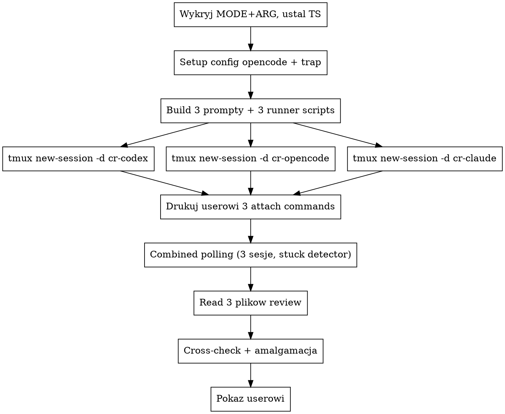

# Równoległe code review: codex + opencode + claude subagent (background + cross-check)

## Kiedy używać

- User uruchamia `/code-review-external [target]`.
- User prosi o "trzy opinie", "external review", "wszystkie naraz",
  "codex+opencode+claude".

NIE używaj, gdy:
- User chce TYLKO jedno z narzędzi → wywołaj `code-review-codex`,
  `code-review-opencode` albo `code-review-claude` bezpośrednio.
- Cel to PR na GitHubie → `/code-review:code-review` jest tam
  grubo lepszy (multi-agent pipeline + scoring + posting komentarza).

## Wymagania

- **`codex` w `$PATH`** (`which codex`).
- **`opencode` w `$PATH`** (`which opencode`).
- **`claude` w `$PATH`** (`which claude` — Claude Code CLI).
- **`tmux` w `$PATH`** (`which tmux`). Wszystkie trzy reviewers
  jadą w osobnych tmux sessions.

Brak któregoś z czterech → zatrzymaj się i powiedz userowi co
zainstalować. Sens skilla = trzy niezależne opinie w trzech
niezależnych terminalach (attachable). Jeśli user chce tylko 2 z 3,
niech użyje indywidualnych skilli.

## Auto-detekcja celu

Wspólna logika 5 trybów (`uncommitted` / `file` / `dir` / `commit` / `free`) — czytaj **`../../shared/target-detection.md`**. Wykryj **raz**, użyj tego samego MODE i ARG dla trzech narzędzi. **Zawsze ogłoś userowi** wykryty tryb zanim odpalisz trzy CLI — przy typo w ścieżce user musi mieć szansę przerwać.

## Architektura: 3 tmux sessions równolegle → combined polling → cross-check

Każdy z trzech reviewers ląduje w osobnej tmux session
(`cr-codex-$TS`, `cr-opencode-$TS`, `cr-claude-$TS`). User w każdym
momencie może zrobić `tmux attach -t cr-<tool>-$TS` żeby zobaczyć
co dany reviewer robi na żywo. Główny agent uruchamia w **jednej
komendzie bash** wszystkie trzy sesje (każde `tmux new-session -d`
zwraca natychmiast) i dalej w tej samej komendzie poluje wszystkie
trzy w combined loop.



Jedno utknięcie (np. opencode wisi na auth) nie blokuje pozostałych
dwóch — combined polling wykrywa stuck po 90s braku progresu i zabija
sesję, polling kontynuuje dla pozostałych. Można świadomie skończyć
z 2 z 3 zamiast czekać 15 min.

### Krok 1: ustal nazwy plików (jeden timestamp dla wszystkich trzech)

```bash
TS=$(date +%Y%m%d-%H%M%S)
export TS    # leaf skille czytają z env

CODEX_SESSION=cr-codex-$TS
OPENCODE_SESSION=cr-opencode-$TS
CLAUDE_SESSION=cr-claude-$TS

CODEX_OUT=/tmp/code-review-codex-$TS.md
OPENCODE_OUT=/tmp/code-review-opencode-$TS.md
CLAUDE_OUT=/tmp/code-review-claude-$TS.md

CODEX_LOG=/tmp/code-review-codex-$TS.log
OPENCODE_LOG=/tmp/code-review-opencode-$TS.log
CLAUDE_LOG=/tmp/code-review-claude-$TS.log

CODEX_RUNNER=/tmp/cr-codex-runner-$TS.sh
OPENCODE_RUNNER=/tmp/cr-opencode-runner-$TS.sh
CLAUDE_RUNNER=/tmp/cr-claude-runner-$TS.sh

PROJECT_ROOT=$(git rev-parse --show-toplevel 2>/dev/null || pwd)
```

### Krok 2: opencode restrictive config + cleanup trap

Zgodnie z `code-review-opencode/SKILL.md`, sekcja "Pełny wrapper
bash" — write `.opencode/opencode.json` z restrictive permissions,
zarejestruj `trap cleanup EXIT INT TERM` który dodatkowo zabija
**wszystkie trzy** tmux sessions (na wszelki wypadek gdy główny
bash dostanie SIGINT w trakcie polling-u).

```bash
cleanup() {
  for s in "$CODEX_SESSION" "$OPENCODE_SESSION" "$CLAUDE_SESSION"; do
    tmux kill-session -t "$s" 2>/dev/null
  done
  # opencode config restore (jak w code-review-opencode):
  if [ -n "$CFG_BACKUP" ] && [ -f "$CFG_BACKUP" ]; then
    mv "$CFG_BACKUP" "$CFG_PATH"
  else
    rm -f "$CFG_PATH"
  fi
  if [ -n "$CFG_DIR_CREATED" ]; then
    rmdir "$CFG_DIR" 2>/dev/null
  fi
}
trap cleanup EXIT INT TERM
```

### Krok 3: zbuduj 3 prompty + 3 runner scripts

Każdy leaf skill ma sekcję "Tryb-specyficzny prompt body" — wybierz
body wg MODE z trzech leaf skilli, dorzuć dyrektywę zapisu (z
`shared/write-directive.md`, z opencode-dopiskiem dla opencode-runnera)
i standardowy prompt review (z `shared/standard-review-prompt.md`).
Zinterpoluj `${OUT}` (różne dla każdego runnera) i `${ARG}`.

Następnie napisz 3 runner scripts (`printf %q` żeby bezpiecznie
zaszyć prompt). Linia w runnerze różni się tylko wywołaniem CLI
(patrz "<TOOL>-specific runner line" w odpowiednim leaf skillu):

```bash
# CODEX_RUNNER:
{
  printf '%s\n' '#!/bin/bash' 'set -o pipefail' 'export NO_COLOR=1'
  printf 'codex exec --skip-git-repo-check --sandbox workspace-write %q </dev/null\n' "$CODEX_PROMPT"
  printf '%s\n' 'EXIT=$?' 'echo' 'echo "===EXIT=$EXIT==="' 'sleep 2'
} > "$CODEX_RUNNER"
chmod +x "$CODEX_RUNNER"

# OPENCODE_RUNNER:
{
  printf '%s\n' '#!/bin/bash' 'set -o pipefail' 'export NO_COLOR=1'
  printf 'opencode run --dir %q --print-logs %q </dev/null\n' "$PROJECT_ROOT" "$OPENCODE_PROMPT"
  printf '%s\n' 'EXIT=$?' 'echo' 'echo "===EXIT=$EXIT==="' 'sleep 2'
} > "$OPENCODE_RUNNER"
chmod +x "$OPENCODE_RUNNER"

# CLAUDE_RUNNER:
{
  printf '%s\n' '#!/bin/bash' 'set -o pipefail' 'export NO_COLOR=1'
  printf 'claude -p %q --permission-mode auto --add-dir /tmp --add-dir %q --allowedTools %q --output-format text </dev/null\n' \
    "$CLAUDE_PROMPT" "$PROJECT_ROOT" "Read Grep Glob Bash Write Edit"
  printf '%s\n' 'EXIT=$?' 'echo' 'echo "===EXIT=$EXIT==="' 'sleep 2'
} > "$CLAUDE_RUNNER"
chmod +x "$CLAUDE_RUNNER"
```

### Krok 4: odpal 3 sesje tmux (po sobie, ale każda zwraca natychmiast)

```bash
for pair in "$CODEX_SESSION:$CODEX_RUNNER:$CODEX_LOG" \
            "$OPENCODE_SESSION:$OPENCODE_RUNNER:$OPENCODE_LOG" \
            "$CLAUDE_SESSION:$CLAUDE_RUNNER:$CLAUDE_LOG"; do
  IFS=: read -r SESS RUN LOG <<< "$pair"
  if tmux has-session -t "$SESS" 2>/dev/null; then
    echo "ERR: sesja $SESS już istnieje — abort"
    exit 1
  fi
  tmux new-session -d -s "$SESS" -x 220 -y 50 "bash '$RUN'"
  tmux pipe-pane -t "$SESS" "cat > '$LOG'"
done

cat <<INFO

▶ Trzy review startują równolegle w tmux:
    Codex:    tmux attach -t $CODEX_SESSION
    Opencode: tmux attach -t $OPENCODE_SESSION
    Claude:   tmux attach -t $CLAUDE_SESSION

  Detach z attached: Ctrl-B D (CLI nadal działa).
  Lista wszystkich: tmux ls

  Output files (po zakończeniu):
    $CODEX_OUT
    $OPENCODE_OUT
    $CLAUDE_OUT

INFO
```

### Krok 5: combined polling (jedna pętla, 3 sesje)

Patrz `../../shared/tmux-runner.md`, sekcja "Wzorzec polling dla
`code-review-external`" — kopiuj 1:1, używa zmiennych ustawionych
wyżej. Pętla kończy się gdy żadna z trzech sesji nie żyje (each
zakończyła się sama lub została zabita przez stuck detector / timeout).

Po pętli `Bash` wraca do agenta. Cleanup trap odpala się gdy bash
kończy → opencode config przywrócony, ewentualne orphaned sesje
tmux zabite (na wszelki wypadek).

### Krok 6: walidacja plików + cross-check + amalgamacja

1. **Sanity-check pliki przez `Bash`**:
   ```bash
   for f in $CODEX_OUT $OPENCODE_OUT $CLAUDE_OUT; do
     [ -f "$f" ] || { echo "MISSING: $f"; continue; }
     SIZE=$(wc -c < "$f")
     SECTIONS=$(grep -c "^## " "$f" || echo 0)
     echo "$f: ${SIZE}B, ${SECTIONS} sekcji"
   done
   ```
   Pusty plik (<200 B) lub brak sekcji = padło, patrz "Co jeśli".

2. **Wczytaj wszystkie trzy pliki** przez `Read` (po jednym).
   Pliki są **już czyste** — leaf skille zadbały o write-tool
   pattern, więc nie ma bannerów ani logów do filtrowania.
   Czytasz 1-3 KB markdownu na każdy.

3. **Cross-check + amalgamacja** — sens tego skilla. Po
   przeczytaniu trzech plików zbuduj **jedną sekcję syntezy** ZA
   trzema surowymi review:

   - **Konsensus (2-3 z 3)** — uwagi wymienione przez przynajmniej
     dwóch agentów. Tagi `[codex] [opencode] [claude]` przy każdej.
     To są najwyższej priorytetu znaleziska — niezależne narzędzia
     zbiegły się, więc są praktycznie pewne.
   - **Rozbieżności (1 z 3)** — uwagi wymienione tylko przez
     jednego. Krótka kategoryzacja w 1 zdaniu: "realny insight
     którego dwóch innych nie złapało" / "idiosynkrazja agenta /
     możliwy false positive" / "specyficzny dla tego narzędzia
     bias". Jeśli nie wiesz — powiedz że nie wiesz. Nie udawaj
     autorytetu.
   - **Sprzeczności** — agenci przeciwni sobie (codex sugeruje
     X, claude sugeruje not-X). Pokaż wprost zamiast smoothować.
   - **Verdict** — 1-2 zdania: stan na podstawie konsensusu, kto
     by mergował a kto nie.

   Krótka sekcja, nie esej. Maks ~25 linii. Cytuj **plik:linia**
   gdy konkretna uwaga ma znaczenie.

4. **Pokaż userowi** w stałej kolejności:

```markdown
## 🤖 codex review

[zawartość $CODEX_OUT — czysta, bez ozdóbek]

---

## 🤖 opencode review

[zawartość $OPENCODE_OUT — czysta, bez ozdóbek]

---

## 🤖 claude review

[zawartość $CLAUDE_OUT — czysta]

---

## 🔀 Cross-check + amalgamacja

[twoja synteza z kroku 4.3 — konsensus, rozbieżności,
sprzeczności, verdict]

---

**Pliki:**
- `$CODEX_OUT`
- `$OPENCODE_OUT`
- `$CLAUDE_OUT`

**Verbose logi (jeśli coś podejrzane, do debugowania):**
- `/tmp/code-review-codex-$TS.log`
- `/tmp/code-review-opencode-$TS.log`
```

**Cross-check ZAWSZE.** Sens skilla = wnioski z trzech opinii,
nie tylko trzy opinie obok siebie. Bez cross-checku to to samo
co odpalenie trzech indywidualnych skilli.

### Co jeśli któreś narzędzie wisi / padło

- **Sesja zabita przez stuck detector po 90s** — w combined polling
  loop log danej sesji nie urósł przez 90s i brak OUT pliku → tmux
  kill-session. To NIE jest błąd, to feature; chroni przed wiszeniem
  15+ min. Pokaż userowi: "X stuck (no progress 90s), zabito sesję".
- **Sesja zabita przez timeout 600s** — całkowity deadline. Pokaż:
  "X timeout 10 min, zabito sesję".
- **Plik review pusty (<200 B) lub brak** → narzędzie zignorowało
  dyrektywę zapisu albo padło zanim zaczęło pisać. `tail -50
  /tmp/code-review-<tool>-$TS.log` pokaże dlaczego (provider error,
  permission denied, auth fail). Pokaż userowi w sekcji
  `⚠️ <narzędzie> padło`.
- **Sesja tmux żyje ale OUT się nie zapełnia** — bardzo rzadkie,
  oznacza że narzędzie pisze coś do pane'a ale nie do pliku. Zajrzyj
  `tmux capture-pane -p -t cr-<tool>-$TS` żeby zobaczyć aktualny
  stan terminala.
- **Cross-check przy 2 z 3** → zaznacz wprost: "amalgamacja na
  podstawie 2 z 3, opinia <padłego> brakuje".
- **Padły 2/3 albo 3/3** → nie udawaj cross-checku, raportuj co
  się stało dla każdego z trzech, pokaż ostatnie linie ich
  log-ów. Nie próbuj retry samodzielnie — zapytaj usera.

## Częste pomyłki

- **Foreground zamiast tmux background.** Stary wzorzec: trzy `Bash
  run_in_background: true` + `Agent` + `TaskOutput x3`. Tracimy:
  attach UX, observability, spójność lifecycle, łatwy kill. Nowy
  wzorzec to **3 tmux sessions, jedna bash komenda z combined polling-iem**.
- **Trzy oddzielne komendy bash zamiast jednej.** Wszystko musi być
  w **jednej** komendzie bash żeby trap cleanup mógł zabić wszystkie
  3 sesje + przywrócić opencode config gdy user przerwie / timeout zadziała.
- **Background dispatch bez tmux.** Trzy tool calls foreground bez
  tmux blokowałyby głównego agenta na czas najdłuższego z trzech.
  W nowym wzorcu agent czeka tylko na **jedną** bash komendę z
  combined polling-iem; w środku tej komendy trzy CLI lecą równolegle
  w tmux sessions. Łączny wall-time = max(t1,t2,t3), agent zajęty
  jednym tool call.
- **Brak `tmux pipe-pane` po `new-session`.** Bez pipe-pane RUN_LOG
  jest pusty i stuck detector po 90s false-aborduje. Każde
  `new-session` musi mieć po sobie `pipe-pane`.
- **Różne timestampy w nazwach plików.** Wygeneruj `$TS` raz przed
  trzema setupami i `export TS`. Trzy różne stamps = trudno znaleźć
  trójkę plików tego samego runa.
- **`pkill -9` zamiast `tmux kill-session`.** Tmux session ma czysty
  lifecycle — `tmux kill-session` zabija pane (i CLI w nim) deterministycznie.
  `pkill -9 -f opencode` może też zabić innego opencode'a usera, czego
  user nie chce. NIGDY nie używaj `pkill` w tym skillu.
- **Pominięcie cross-checku.** Cross-check + amalgamacja są
  **obowiązkowe**, nie opcjonalne. Bez nich user dostaje to samo co
  odpalenie trzech indywidualnych skilli — bez wartości dodanej.
- **Synteza która chowa rozbieżności.** Wartość cross-checku =
  pokazanie konsensusu vs rozbieżności. Smoothowanie ich ("wszyscy
  mniej-więcej widzieli to samo") gubi sygnał.
- **Próba parsowania RUN_LOG** zamiast czytania `$OUT`. RUN_LOG to
  capture pane'a (z ANSI codami i bannerami) — do debug only.
  Plik review (OUT) ma czysty markdown, zapisany przez CLI write tool.
- **Pominięcie `which codex && which opencode && which claude && which tmux`
  na starcie.** Lepiej powiedzieć od razu czego brakuje zamiast startować
  niekompletny pipeline.
- **Zmiana review przy zapisie/displayu.** Pliki + display pokazują
  **dosłownie** to co zwróciły narzędzia. Bez parafraz, bez "skróciłem".
  Twoja synteza idzie do osobnej sekcji "Cross-check".
- **Pominięcie ogłoszenia 3 attach commands na starcie.** Sens refactora
  to observability — user musi wiedzieć **przed** rozpoczęciem polling-u
  jakie sesje może podłączyć. Drukuj 3 commands wprost zaraz po
  `tmux new-session`, NIE dopiero po zakończeniu polling-u.
- **Brak `tmux kill-session` w cleanup trap.** Jeśli user wciska Ctrl-C
  w głównym agencie, polling przerwie się ale tmux sessions żyją dalej
  z 3 CLI w środku. Trap MUSI zabić wszystkie 3 sesje.
- **Czytanie OUT-ów PRZED zakończeniem polling-u.** Plik może być
  niekompletny gdy CLI nadal pisze. ZAWSZE czekaj aż polling loop
  skończy się (wszystkie tmux has-session = false) zanim `Read` OUT.
