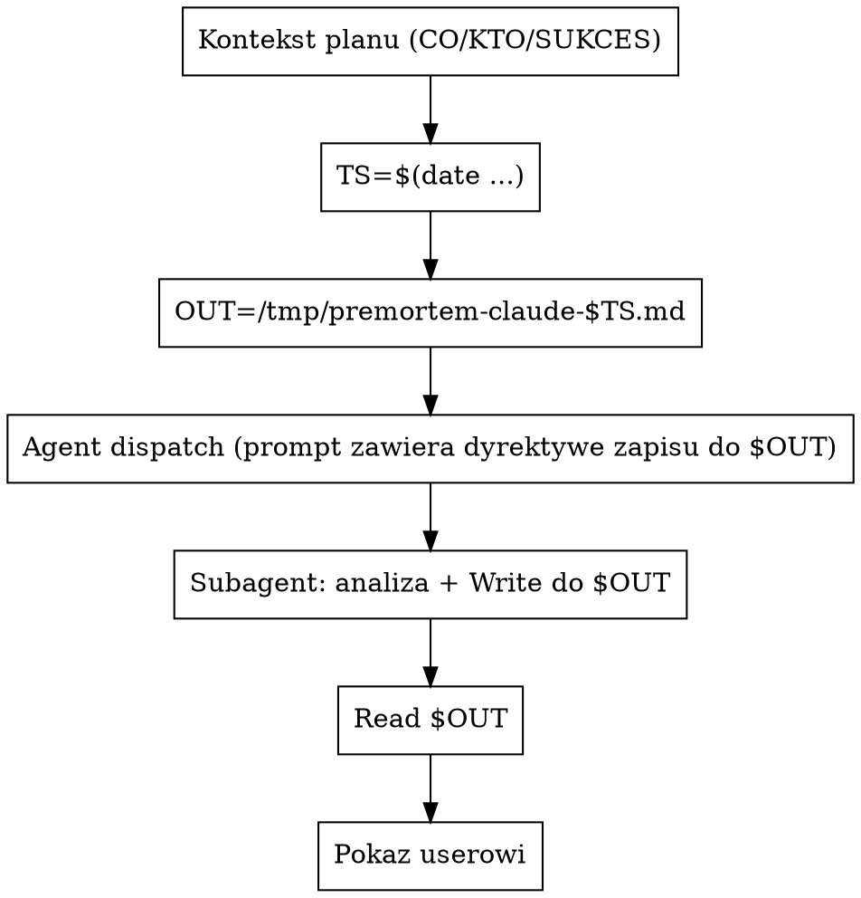

# Premortem przez subagenta Claude

## Kiedy używać

- User uruchamia `/premortem-claude [plan-description]`.
- User wprost prosi o "premortem przez claude'a", "trzecią opinię od
  claude'a w premortem".
- W ramach `premortem-multiple` (równolegle do codex/opencode).

NIE używaj, gdy:
- User chce premortem zrobiony "w trybie konwersacji" przez Ciebie
  bezpośrednio → po prostu użyj skilla `premortem` (oryginalny). Ten
  skill ma sens dla równoległości z innymi narzędziami albo izolacji
  kontekstu (subagent nie ma śmieci z konwersacji).
- User chce review kodu → `code-review-claude`.

## Co dostaje skill

Trzy elementy minimalne planu (CO / KTO / SUKCES). Brak któregoś →
zadaj **jedno** pytanie. Wrapper podaje kontekst gotowy.

## Mechanizm: subagent przez `Agent` tool (artifact-file pattern)

Wywołujesz `Agent` tool z `subagent_type: "general-purpose"`, `description: "Premortem (claude)"`. Subagent dostaje pełny prompt premortem + dyrektywę zapisu — pisze finalny raport **wprost do pliku** przez Write tool (subagent ma Write w domyślnej allowliście). Konsystentnie z codex/opencode w nowym wzorcu.



Przed dispatchem ustal nazwy plików (jeśli nie zostały podane przez wrapper):

```bash
TS=${PREMORTEM_TS:-$(date +%Y%m%d-%H%M%S)}
OUT=/tmp/premortem-claude-$TS.md
```

`OUT` jest interpolowany do prompta subagenta jako konkretna ścieżka — subagent NIE wykrywa go sam, main agent musi go podstawić w prompt string przed Agent dispatch.

## Prompt subagenta (kompletny)

Dispatchuj `Agent` z `subagent_type: "general-purpose"`, `description: "Premortem (claude)"`, i `prompt` zbudowanym z **dwóch części**:

**Część A: standardowy blok premortem (wspólny)** — czytaj **`../../shared/standard-premortem-prompt.md`** i wstaw zawartość bloku 1:1. To zawiera kontekst planu, przesłankę, 3 kroki, format wyjścia.

**Część B: dyrektywa zapisu** — czytaj **`../../shared/write-directive.md`** i wstaw zawartość 1:1 (subagent ma `Write` tool z domyślnej allowlisty `general-purpose`, więc zapisze do `${OUT}` zamiast zwracać tekst). **`${OUT}` MUSI być przed-podstawione** przez main agent w prompt string — subagent dostaje literał, nie zmienną.

Łączny prompt subagenta = Część A + Część B.

## Po wykonaniu

1. Sprawdź czy `$OUT` istnieje i ma sensowny rozmiar (`wc -c "$OUT"` ≥ 200 B). Pusty / brak → subagent zignorował dyrektywę zapisu albo padł — pokaż userowi `Agent` task output żeby zobaczyć dlaczego.
2. Wczytaj `$OUT` przez `Read`.
3. Standalone — pokaż userowi zawartość pliku raz. Wywołany przez `premortem-multiple` — nie drukuj, wrapper sam to złoży.
4. Powiedz userowi 1 zdaniem: "Claude premortem zapisany w `$OUT`."

## Częste pomyłki

- **Niedispatching subagenta, tylko zrobienie premortemu w main
  agencie.** Sens skilla = oddzielny kontekst (subagent nie ma
  śmieci z konwersacji) + równoległe wykonanie z codex/opencode
  w wrapperze. Robienie tego w main agencie unieważnia oba zyski —
  jeśli user chce premortem bezpośrednio od Ciebie, użyj oryginalnego
  skilla `premortem`.
- **Inny `subagent_type` niż `general-purpose`.** Niektóre
  wyspecjalizowane agenty wyglądają kuszące, ale są pluginowo-zależne.
  `general-purpose` z dobrym promptem jest portable.
- **Pominięcie dyrektywy zapisu w prompcie subagenta.** Subagent w nowym wzorcu **sam pisze** raport do `$OUT` przez Write tool. Bez dyrektywy (Część B, z `shared/write-directive.md`) zwróci tekst zamiast zapisać plik — wrapper czeka na plik, dostanie pusty.
- **`$OUT` nie zinterpolowane w prompcie subagenta.** Subagent dostaje literalny string prompta — main agent musi podstawić aktualną wartość `$OUT` (np. `/tmp/premortem-claude-20260508-100530.md`) zanim wywoła `Agent`. Sprawdź wzrokowo że ścieżka w prompcie to konkretny plik, nie literał `${OUT}`.
- **Pominięcie przesłanki "to już padło"** w prompcie subagenta. Bez
  tego analiza ślizga się do politycznego "risk assessment" —
  premortem przestaje działać jako mechanizm.
- **Mieszanie z code review** — to NIE `code-review-claude`. Tu
  subagent analizuje plan biznesowy, nie kod.
