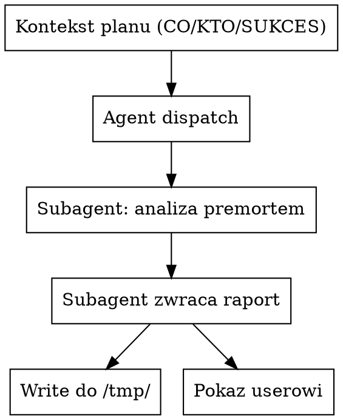

# Premortem przez subagenta Claude

## Kiedy używać

- User uruchamia `/premortem-claude [plan-description]`.
- User wprost prosi o "premortem przez claude'a", "trzecią opinię od
  claude'a w premortem".
- W ramach `premortem-multiple` (równolegle do codex/opencode).

NIE używaj, gdy:
- User chce premortem zrobiony "w trybie konwersacji" przez Ciebie
  bezpośrednio → po prostu użyj skilla `premortem` (oryginalny). Ten
  skill ma sens dla równoległości z innymi narzędziami albo izolacji
  kontekstu (subagent nie ma śmieci z konwersacji).
- User chce review kodu → `code-review-claude`.

## Co dostaje skill

Trzy elementy minimalne planu (CO / KTO / SUKCES). Brak któregoś →
zadaj **jedno** pytanie. Wrapper podaje kontekst gotowy.

## Mechanizm: subagent przez `Agent` tool

Wywołujesz **`Agent` tool** z `subagent_type: "general-purpose"`,
`description: "Premortem (claude)"`, i pełnym promptem premortem
poniżej.

Po zwróceniu wyniku przez agenta:
1. **Zapisz** wynik do `/tmp/premortem-claude-<TS>.md` przez `Write`
   tool (subagent zwraca tekst, nie zapisuje sam).
2. Pokaż userowi (chyba że wywołany przez wrapper).

`<TS>` — jeśli wrapper przekazał konkretny timestamp w prompcie
agenta (np. "TIMESTAMP: 20260507-123455"), użyj go w nazwie pliku.
Standalone → wygeneruj `date +%Y%m%d-%H%M%S` przed dispatchem.



## Prompt subagenta (kompletny — skopiuj 1:1)

Dispatchuj `Agent` z `subagent_type: "general-purpose"`,
`description: "Premortem (claude)"`, i `prompt`:

```
Robisz premortem metodą Gary'ego Kleina (HBR, polecane przez
Kahnemana). Pisz po polsku. Konkret nie ogólnik. Senior strategist,
nie polite advisor.

PLAN DO PRZEANALIZOWANIA:
---
[TU WRAPPER WSTAWIA KONTEKST PLANU: co to jest jednym zdaniem,
 dla kogo / na kogo wpływa, co znaczy sukces. Standalone — to co
 user napisał w wiadomości po nazwie skilla.]
---

[Opcjonalnie: TIMESTAMP: <YYYYMMDD-HHMMSS> — żeby wrapper znał
nazwę pliku gdzie zapisać twój output.]

PRZESŁANKA PREMORTEMU (NIE POMIJAJ — to mechanizm psychologiczny):
Jest 6 miesięcy w przyszłości. Ten plan **już padł**. Skończony.
Nie pytasz "czy to dobry plan" (to wywołuje przytakiwanie). Pytasz
"jak ten plan umarł" — to wymusza specyficzne, uczciwe powody.

ZANIM RUSZYSZ — opcjonalnie zorientuj się w workspace:
- Jest `CLAUDE.md` w cwd? Przeczytaj — może zawierać kontekst
  biznesowy / poprzednie decyzje istotne dla tego planu.
- Jest folder `memory/` z notatkami? Sprawdź ich zawartość krótko.
- Cap 30 sekund, nie szukaj wyczerpująco. Tylko grounding.

KROK 1 — Lista przyczyn śmierci:
Wygeneruj WSZYSTKIE realne powody, dla których plan padł. Każdy:
- specyficzny dla TEGO planu (nie generyczny "ryzyko rynku"),
- ugruntowany w detalach (konkretna cena, konkretna grupa,
  konkretna decyzja),
- realnym zagrożeniem (nie edge case ani niewygoda).

Liczba: tyle ile naprawdę istnieje. 4 albo 9. Nie wymyślaj 7-go żeby
zapełnić, nie zatrzymuj się na 3 jeśli jest ich 7.

KROK 2 — Deep-dive per przyczyna:
Dla KAŻDEJ przyczyny z kroku 1:
1. **Historia upadku** (2-3 akapity) — narracja jak się rozegrało,
   konkretne momenty, konkretne reakcje. Case study, nie risk
   assessment.
2. **Ukryte założenie** (1 zdanie) — to JEDNO co user wziął za
   pewnik, co umożliwiło tę porażkę.
3. **Wczesne sygnały** (1-2 obserwowalne sygnały) — coś co da się
   zobaczyć/zmierzyć, nie przeczucia.

KROK 3 — Synteza:
1. **Najbardziej prawdopodobna porażka** + dlaczego (tu user
   skupia wysiłek).
2. **Najbardziej groźna porażka** (worst damage, nawet jeśli mniej
   likely — warto asekurować).
3. **Najgłębsze ukryte założenie** z całej analizy.
4. **Rewizja planu** — KONKRETNE zmiany mapowane do konkretnych
   porażek. NIE "przemyśl strategię". TAK "uruchom pilot 20 osób
   za 47$ przed pełnym launchem za 297$". Każda rewizja wykonalna
   w tym tygodniu.
5. **Checklist przed startem** — 3-5 konkretów do zweryfikowania
   przed pociągnięciem spustu, każdy zapobiega konkretnej porażce.

CO BEZWZGLĘDNIE POMIJAĆ:
- Generyki ("ryzyko rynku", "ryzyko egzekucji").
- Edge case'y bez praktycznego znaczenia.
- "Warto rozważyć X" — produkujesz konkrety, nie watered-down porady.
- Balansowanie ("plan ma swoje plusy") — jesteś po stronie znalezienia
  śmierci, nie ważenia opinii.
- Cukrowanie. User chce słyszeć rzeczy zanim usłyszy ich od
  rzeczywistości.

FORMAT ODPOWIEDZI (markdown, po polsku):

## Premortem [nazwa planu w 1 zdaniu]

### Przyczyny śmierci (krok 1)

Numerowana lista, każdy punkt 1-2 zdania.

### Deep-dive

#### 1. [tytuł przyczyny]
**Historia upadku:** ...
**Ukryte założenie:** ...
**Wczesne sygnały:** ...

(powtórz dla każdej)

### Synteza

**Najbardziej prawdopodobna porażka:** ...
**Najbardziej groźna porażka:** ...
**Najgłębsze ukryte założenie:** ...

**Rewizja planu:**
- ... (każda rewizja → konkretna porażka)

**Checklist przed startem:**
- [ ] ... (każda pozycja → konkretna porażka)

NIE pisz preambuły ("zaraz zrobię premortem..."). NIE podsumowuj na
koniec ("zakończyłem analizę"). Main agent dostaje twój output 1:1.
```

## Po wykonaniu

1. Po zwróceniu treści przez `Agent`, **`Write`** ten tekst dosłownie
   do `/tmp/premortem-claude-$TS.md`. (Nazwa z tym samym `$TS` co
   w wrapperze, jeśli wrapper podał).
2. Standalone → pokaż userowi cały zwrócony markdown.
3. Wywołany przez `premortem-multiple` → nie drukuj zawartości,
   wrapper sam to złoży.
4. Powiedz userowi 1 zdaniem: "Claude premortem zapisany w `$OUT`."

## Częste pomyłki

- **Niedispatching subagenta, tylko zrobienie premortemu w main
  agencie.** Sens skilla = oddzielny kontekst (subagent nie ma
  śmieci z konwersacji) + równoległe wykonanie z codex/opencode
  w wrapperze. Robienie tego w main agencie unieważnia oba zyski —
  jeśli user chce premortem bezpośrednio od Ciebie, użyj oryginalnego
  skilla `premortem`.
- **Inny `subagent_type` niż `general-purpose`.** Niektóre
  wyspecjalizowane agenty wyglądają kuszące, ale są pluginowo-zależne.
  `general-purpose` z dobrym promptem jest portable.
- **Pominięcie `Write` po dispatchu.** Subagent zwraca tekst, nie
  zapisuje pliku. Bez `Write` plik `$OUT` nie powstanie i wrapper
  będzie niespójny.
- **Modyfikacja outputu w drodze do pliku.** Zapisz **dosłownie** to
  co zwrócił subagent, bez parafraz, bez wstępów.
- **Pominięcie przesłanki "to już padło"** w prompcie subagenta. Bez
  tego analiza ślizga się do politycznego "risk assessment" —
  premortem przestaje działać jako mechanizm.
- **Mieszanie z code review** — to NIE `code-review-claude`. Tu
  subagent analizuje plan biznesowy, nie kod.
