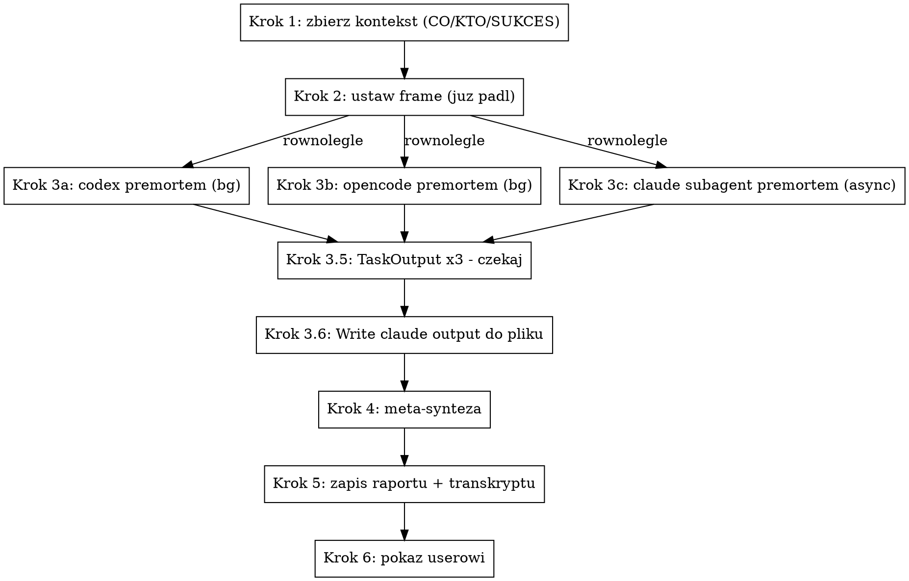

# Premortem multiple — trzy premortemy + synteza

## Kiedy używać

- User uruchamia `/premortem-multiple [plan-description]`.
- User prosi o "trzy opinie premortem", "premortem przez wszystkich",
  "codex + opencode + claude na premortem".
- Stawka decyzji jest na tyle wysoka, że pojedynczy premortem to
  za mało (launch, hire, partnership, pricing change z mocnym
  downside).

NIE używaj, gdy:
- User chce **jeden** premortem zrobiony przez Ciebie konwersacyjnie
  → `/premortem:premortem` (oryginalny, interaktywny, z HTML raportem).
- User chce tylko jedno z trzech narzędzi → `/premortem-codex`,
  `/premortem-opencode`, `/premortem-claude`.
- User chce **trzy surowe** opinie bez syntezy → ten skill też się
  nadaje (synteza jest na końcu, surówki są w transkrypcie), ale
  uprzedź usera że robisz syntezę i czy ma wartość.
- Plan jest jeszcze mglisty / nieskonkretyzowany → premortem na
  vague idea = generyczne wnioski. Pomóż userowi najpierw skonkretyzować
  plan, potem premortem.

## Wymagania

- **`codex`** w `$PATH`.
- **`opencode`** w `$PATH`.
- Subagent Claude — zawsze dostępny przez `Agent` tool.

Brak któregoś z dwóch CLI → **zatrzymaj się** i powiedz userowi co
zainstalować. Nie kontynuuj z dwoma — sens skilla = trzy niezależne
opinie. Jeśli user chce tylko 2 z 3, niech użyje pojedynczych skilli.

## Architektura (background dispatch → wait → meta-synteza)

Trzy premortemy uruchamiamy **w tle**, główny agent czeka na każdego
przez `TaskOutput` (block: true), dopiero po komplecie idzie do
meta-syntezy. Background pozwala świadomie reagować jeśli któreś
narzędzie utknie (np. opencode bywa kapryśny) — zamiast blokować
całość, możesz pokazać 2 z 3 i zapytać usera czy czekać dłużej.



## Krok 1 — Zbierz minimum kontekstu

Premortem bez kontekstu = bezwartościowy. Zanim cokolwiek dispatchujesz,
upewnij się że masz **trzy rzeczy**:

1. **CO to jest?** — Plan w jednym zdaniu.
2. **KTO?** — Audience / stakeholders / zespół / na kogo wpływa.
3. **SUKCES?** — Co znaczy "się udało". Porażka jest inwersją sukcesu;
   bez kryterium sukcesu nie da się zdefiniować śmierci.

**Najpierw skanuj, potem pytaj.** Sprawdź szybko (cap 30s):
- Wcześniejsze tury rozmowy.
- `CLAUDE.md` w cwd.
- `memory/` jeśli istnieje.
- Pliki które user zaattachował lub wskazał.
- Briefe / docs powiązane z planem w cwd.

**Brakuje którejś z trzech rzeczy** → zadaj **jedno** pytanie
o najważniejszą lukę. Po odpowiedzi re-evaluuj. Nie pytaj wielu rzeczy
naraz, nie dopytuj o niepotrzebne. Konwersacyjnie, nie przesłuchanie.

Nie odpalaj trzech CLI bez kontekstu — generyczny plan = generyczna
analiza × 3 = 3× więcej wody niż waters jednego zwykłego premortemu.

## Krok 2 — Ustaw frame

Powiedz **na głos**:

> "OK, mam dość kontekstu. Odpalamy potrójny premortem. Przesłanka:
> jest 6 miesięcy w przyszłości, [ten plan] padł, skończony. Trzy
> niezależne narzędzia (codex, opencode, claude subagent) cofają się,
> żeby znaleźć dlaczego."

To NIE jest ozdobnik. To psychologiczny mechanizm który zamienia
"oceń ten plan" (przytakiwanie) na "wytłumacz dlaczego umarło"
(uczciwe powody). Bez tego wszyscy trzej zaczynają lecieć grzecznym
risk assessmentem. **Nie pomijaj.**

## Krok 3 — Trzy równoległe premortemy w tle

**Wszystkie trzy w jednej wiadomości**, każdy w trybie background.
Tool calls w tym samym message bloku startują równolegle — w trybie
bg każdy zwraca task ID natychmiast i nie blokuje głównego agenta.
Czekanie na wyniki idzie osobno w kroku 3.5 przez `TaskOutput`.

### Krok 3.0 — Ustal nazwy plików (jeden timestamp)

```bash
TS=$(date +%Y%m%d-%H%M%S)
CODEX_OUT=/tmp/premortem-codex-$TS.md
OPENCODE_OUT=/tmp/premortem-opencode-$TS.md
CLAUDE_OUT=/tmp/premortem-claude-$TS.md
```

Zapamiętaj `$TS` — przekazujesz go do każdego z trzech wywołań,
żeby później sparować trójkę plików tego samego runa. Wrapper również
go używa do nazwy raportu i transkryptu.

### Krok 3.1 — Trzy background tool calls w jednym message

W **jednej** wiadomości — wszystkie trzy uruchamiają się w trybie
artifact-file (każde narzędzie samo pisze finalny premortem do
wskazanego pliku przez swój write tool, my czytamy potem czysty
plik):

1. **`Bash`** (codex), `run_in_background: true`:
   - Komenda zgodnie z `premortem-codex` — **artifact file pattern**:
     codex pisze raport do `$CODEX_OUT` przez write tool, stdout
     do `/tmp/premortem-codex-$TS.log`.
   - Eksportuj `PREMORTEM_TS=$TS` żeby skill użył tego samego stampa:
     `PREMORTEM_TS=$TS codex exec "..."`.
   - W prompt wstaw kontekst planu z kroku 1 (CO/KTO/SUKCES) +
     prompt premortem + **dyrektywę zapisu** wskazującą `$CODEX_OUT`.
   - `> "$RUN_LOG" 2>&1` (NIE `tee`), timeout `600000` ms.
   - description: `premortem codex`.
   - **Zapamiętaj zwrócony `task_id`.**

2. **`Bash`** (opencode), `run_in_background: true`:
   - Komenda zgodnie z `premortem-opencode` — **artifact file +
     tymczasowy project-local `.opencode/opencode.json` + trap
     cleanup**.
   - Restrykcyjny config: `read/glob/grep/bash` deny, edit allow
     tylko dla `/tmp/premortem-*`. Premortem nie czyta projektu,
     więc deny nie boli.
   - Ten sam kontekst planu + prompt premortem + dyrektywa zapisu
     wskazująca `$OPENCODE_OUT`.
   - `--dir "$PROJECT_ROOT"`, `> "$RUN_LOG" 2>&1`, timeout `600000` ms.
   - description: `premortem opencode`.
   - **Zapamiętaj `task_id`.**

3. **`Agent`** (claude) — domyślnie zwraca async task:
   - `subagent_type: "general-purpose"`.
   - `description: "Premortem (claude)"`.
   - `prompt`: pełny prompt z `premortem-claude`, sekcja "Prompt
     subagenta", z wstawionym kontekstem planu **oraz** dyrektywą
     żeby subagent **napisał raport wprost do `$CLAUDE_OUT` przez
     Write tool** (zamiast zwracać tekst). Konsystentnie z codex/
     opencode — czytamy potem tylko plik.
   - **Zapamiętaj zwrócony `agentId`.**

Po dispatchu masz 3 task IDs i wracasz do głównej kontroli —
nic nie blokuje.

### Krok 3.5 — Czekaj na wszystkie trzy przez `TaskOutput`

Sekwencyjnie wywołaj `TaskOutput` dla każdego z trzech task ID
z `block: true` i `timeout: 600000` (10 min na sztukę). Każde
wywołanie blokuje aż dany task się skończy albo timeout wybije.
Ponieważ wszystkie trzy uruchomiły się równolegle, łączny czas
oczekiwania = max(t1, t2, t3), nie suma.

`TaskOutput` zwróci status `completed` lub `failed`. Sam result
text-u nie potrzebujemy — premortem jest w plikach `$CODEX_OUT`,
`$OPENCODE_OUT`, `$CLAUDE_OUT`.

Jeśli `TaskOutput` zwróci status `running` po 600s — task wisi,
patrz "Co jeśli któreś padło / wisi" niżej.

### Krok 3.6 — Walidacja plików

```bash
for f in $CODEX_OUT $OPENCODE_OUT $CLAUDE_OUT; do
  [ -f "$f" ] || { echo "MISSING: $f"; continue; }
  SIZE=$(wc -c < "$f")
  echo "$f: ${SIZE}B"
done
```

Pusty (<200 B) lub brak = narzędzie padło lub zignorowało dyrektywę
zapisu. `tail -50 /tmp/premortem-X-$TS.log` pokaże dlaczego. Patrz
"Co jeśli któreś padło / wisi" niżej.

## Krok 4 — Meta-synteza (sens tego skilla)

Tu jest cała wartość ponad trzema pojedynczymi premortemami. Czytasz
wszystkie trzy outputy i robisz **analizę krzyżową**.

**Czytaj pliki przez `Read`:**

Pliki są **już czyste** — leaf skille (`premortem-codex`,
`premortem-opencode`, `premortem-claude`) używają artifact-file
pattern, więc każde narzędzie pisze prosto do `$X_OUT` przez
swój write tool. Nie ma bannerów, nie ma reasoning, nie ma
"Thinking..." — to czysty markdown 2-5 KB każdy.

```
Read $CODEX_OUT
Read $OPENCODE_OUT
Read $CLAUDE_OUT
```

Verbose logi (`/tmp/premortem-X-$TS.log`) zostawiamy w spokoju —
służą tylko do debugowania kiedy plik review jest pusty/uszkodzony.

### Co zsyntezować

Zbuduj **jeden** dokument zawierający:

#### 4.1 — Konsensus przyczyn śmierci

Przyczyny śmierci wymienione przez **2 lub 3 z 3 agentów**. To
najwyższe ryzyka — niezależne narzędzia zbiegły się na ten sam
problem. Dla każdej:
- Krótki opis (1-2 zdania).
- Tagi `[codex] [opencode] [claude]` pokazujące którzy ją widzieli.
- Najlepsza wersja deep-dive'a — wybierz najmocniejszą historię
  upadku z trzech, albo połącz najlepsze elementy. Cytuj agentów
  jeśli konkretne sformułowanie jest mocne.

#### 4.2 — Rozbieżności (often najciekawsze)

Przyczyny śmierci wymienione przez **tylko 1 z 3 agentów**. Trzy
możliwości:
- **Realny insight** — jeden agent zauważył coś, czego dwóch nie.
  Często ekstremalnie wartościowe.
- **Idiosynkrazja agenta** — szum, którego dwóch innych słusznie
  pominęło.
- **Specyficzny dla narzędzia bias** — np. codex może być bardziej
  techniczny, opencode bardziej rynkowy, claude bardziej
  produktowy.

Dla każdej rozbieżności krótko **oceń** którą z trzech kategorii
to jest, na podstawie konkretu w deep-dive. Jeśli nie wiesz — powiedz
że nie wiesz. Nie udawaj autorytetu.

#### 4.3 — Ukryte założenia

Wszystkie ukryte założenia z trzech analiz w jednej liście. Szukaj
**wspólnego wątku** — często trzech agentów inaczej formułuje to
samo założenie. Pokaż je razem.

#### 4.4 — Najbardziej prawdopodobna porażka

Przeczytaj 3 syntezy "najbardziej prawdopodobna" z trzech raportów.
Jeśli się zgadzają → to jest ona. Jeśli nie zgadzają → wybierz
najmocniej uzasadnioną i powiedz że dwóch innych miało inne typy
(z linią po linijce kogo na co stawiał).

#### 4.5 — Najbardziej groźna porażka

Analogicznie do 4.4 — często wszyscy trzej zgodzą się szybciej tutaj
niż na "najbardziej prawdopodobnej".

#### 4.6 — Ujednolicona rewizja planu

**Skonsoliduj** wszystkie konkretne rewizje z trzech raportów.
Deduplikuj. Skoryguj sprzeczności (jeśli codex sugeruje "podnieś
cenę", a opencode "obniż cenę" — pokaż to jako development
rozbieżność, nie ukrywaj). Każda rewizja:
- Mapowana do konkretnej porażki (z konsensusu albo rozbieżności).
- Wykonalna w tym tygodniu.
- Bez "warto rozważyć" — konkrety.

#### 4.7 — Checklist przed startem

Połącz checklisty trzech agentów. Deduplikuj. Każda pozycja:
- Zapobiega konkretnej porażce.
- Da się zrobić / zweryfikować przed pociągnięciem spustu.

#### 4.8 — Co robisz z tym dokumentem

3 zdania na końcu: gdzie user **najpierw** powinien skupić uwagę
(zwykle = najbardziej prawdopodobna porażka + jej rewizja), co
dopisać do kalendarza (jak/kiedy weryfikować checklist), kiedy
wrócić do tego dokumentu (zwykle: punkt sprawdzający za 2 tygodnie
albo przy konkretnym sygnale ostrzegawczym).

## Krok 5 — Zapis raportu + transkryptu

Dwa pliki w **cwd** (nie `/tmp/` — to jest deliverable usera):

```
premortem-multiple-report-<TS>.md       # synteza (primary, do czytania)
premortem-multiple-transcript-<TS>.md   # 3 surowe outputy + meta info
```

Użyj **tego samego `$TS`** co w `/tmp/premortem-{codex,opencode,claude}-$TS.md`,
żeby user mógł później zlokalizować wszystkie 5 plików tego samego runa.

### Raport (`premortem-multiple-report-<TS>.md`)

Struktura:

```markdown
# Premortem multiple: [nazwa planu w 1 zdaniu]

**Timestamp:** <YYYY-MM-DD HH:MM:SS>
**Plan:** [pełny opis CO/KTO/SUKCES]
**Reviewerzy:** codex, opencode, claude (subagent general-purpose)

---

## Konsensus przyczyn śmierci

(synteza z 4.1 — wymienione przez 2+ agentów)

## Rozbieżności

(synteza z 4.2 — tylko 1 agent)

## Ukryte założenia

(synteza z 4.3)

## Najbardziej prawdopodobna porażka

(synteza z 4.4)

## Najbardziej groźna porażka

(synteza z 4.5)

## Ujednolicona rewizja planu

(synteza z 4.6)

## Checklist przed startem

(synteza z 4.7)

## Co robić dalej

(synteza z 4.8)

---

**Pliki źródłowe (surowe outputy trzech agentów):**
- `/tmp/premortem-codex-<TS>.md`
- `/tmp/premortem-opencode-<TS>.md`
- `/tmp/premortem-claude-<TS>.md`

**Transkrypt:** `premortem-multiple-transcript-<TS>.md`
```

### Transkrypt (`premortem-multiple-transcript-<TS>.md`)

Konkatenacja trzech surowych outputów + nagłówki:

```markdown
# Premortem multiple — transcript

**Timestamp:** <YYYY-MM-DD HH:MM:SS>
**Plan:** [pełny opis CO/KTO/SUKCES]

---

## codex (raw output)

[zawartość $CODEX_OUT — od pierwszego `##` nagłówka, banner wytnij]

---

## opencode (raw output)

[zawartość $OPENCODE_OUT — analogicznie]

---

## claude (raw output)

[zawartość $CLAUDE_OUT — czysta]
```

## Krok 6 — Pokaż userowi

W chacie pokaż **streszczenie 4-zdaniowe** (nie pełny raport):

1. Najbardziej prawdopodobna porażka (1 zdanie).
2. Najbardziej groźna porażka (1 zdanie).
3. Ujednolicone, najważniejsze działanie do zrobienia w tym tygodniu
   (1 zdanie).
4. Gdzie reszta: `premortem-multiple-report-<TS>.md` w cwd
   (transkrypt + 3 surowe outputy w `/tmp/` jeśli user chce drążyć).

Pełny raport user otworzy sobie sam — chat pokaże tylko esencję.

## Co jeśli któreś narzędzie padło / wisi

- **Codex** zwrócił non-zero / pusty plik → pokaż meta-syntezę z
  pozostałych dwóch (ale **wprost** napisz w raporcie: "codex padł,
  synteza z 2 z 3"). Dodaj sekcję `⚠️ codex padł — ostatnie linie
  $CODEX_OUT:` z `tail -10 $CODEX_OUT`.
- Analogicznie opencode i claude.
- **`TaskOutput` zwrócił status `running` po timeoucie 600s** —
  task wisi. Pokaż userowi co masz (2 outputy + komunikat
  "X-narzędzie wisi N min, ostatnia aktywność: ..."). **Nie zabijaj
  procesu samodzielnie**, zapytaj usera czy czekać dłużej, czy
  jechać dalej z 2 z 3, czy zrezygnować z całości.
- **Padło 2/3 albo 3/3** → nie udawaj syntezy z jednego agenta. Synteza
  z jednego = zwykły premortem, w którym wartość multi-agent zniknęła.
  Powiedz userowi wprost co padło, pokaż ostatnie linie wyjść,
  zaproponuj odpalić ponownie albo użyć indywidualnych skilli.
  Nie próbuj retry sam bez pytania.

## Częste pomyłki

- **Stary wzorzec `tee` zamiast artifact file.** Już nie używamy.
  Leaf skille (codex/opencode/claude) same piszą finalny premortem
  do swojego `$X_OUT` przez write tool. Wrapper czyta tylko czyste
  pliki. To eliminuje banner ASCII, reasoning, logi postępu w
  kontekście Claude'a (50+ KB śmieci → 2-5 KB markdownu).
- **Pominięcie dyrektywy zapisu w prompcie.** Bez niej narzędzie
  zwróci premortem na stdout, plik `$X_OUT` nie powstanie. Każdy
  z trzech promptów MUSI zawierać dyrektywę "zapisz do `$X_OUT`
  przez write tool".
- **Pominięcie tymczasowego config opencode + trap cleanup.**
  opencode w non-TTY blokuje się na permission asks — bez
  project-local config wisi 60+ min bez output. Patrz `premortem-opencode`,
  sekcja "Wrapper bash".
- **Foreground zamiast background.** Bez `run_in_background: true`
  Bash blokuje głównego agenta na czas najdłuższego z trzech.
- **Sekwencyjne odpalenie zamiast równoległego.** Trzy tool calls
  MUSZĄ być w jednym message bloku — wtedy startują razem. Sam
  fakt że są w trybie bg nie czyni ich równoległymi jeśli zostaną
  rozdzielone między message bloki.
- **Sekwencyjne `TaskOutput` z błędnym założeniem że to opóźnia.**
  `TaskOutput(codex)` blokuje tylko na codex, ale codex i tak
  pracuje równolegle z opencode i claude. Łączny czas oczekiwania
  = max z trzech, nie suma. Sekwencyjność jest tu OK i prostsza.
- **Różne timestampy w nazwach plików.** Wygeneruj `$TS` raz, podstaw
  wszędzie (eksportuj `PREMORTEM_TS=$TS` do Bash-ów, dopisz
  `TIMESTAMP: $TS` do prompta agenta). Pięć plików tego samego runa
  ma mieć ten sam stamp.
- **Brak dyrektywy zapisu w prompcie subagenta Claude'a.**
  W nowym wzorcu prompt subagenta każe **napisać premortem wprost
  do `$CLAUDE_OUT` przez Write tool** zamiast zwracać tekst.
  Wtedy konsystentnie z codex/opencode czytamy tylko plik.
- **Pominięcie meta-syntezy.** Sens skilla = synteza, nie 3 surówki
  obok siebie (od tego jest `code-review-external` style — 3 obok
  siebie). Tu user dostaje **jeden** dokument. Brak meta-syntezy =
  zły skill, użyj indywidualnych.
- **Synteza bez zaznaczenia kto co widział.** Konsensus 2/3 vs 3/3
  to różnica. Rozbieżność (1/3) to często sygnał. Tagowanie
  `[codex] [opencode] [claude]` przy każdym punkcie konsensusu
  i rozbieżności nie jest dekoracją, to dane.
- **Ukrywanie sprzeczności między agentami.** Jeśli codex sugeruje
  "podnieś cenę" a opencode "obniż" — pokaż to wprost. User dostaje
  multi-agent dokładnie po to, żeby widzieć rozbieżności, nie żeby
  je smoothować.
- **Premortem bez kontekstu (CO/KTO/SUKCES).** Trzy generyczne
  premortemy = 3× więcej szumu niż jeden. Lepiej spytać o brakujące
  rzeczy.
- **Skipping framingu "to już padło".** Bez tej linijki w prompcie
  wszyscy trzej lecą politycznym risk assessmentem. To nie jest
  ozdobnik — to mechanizm.
- **Drukowanie pełnego raportu w chacie.** User otworzy plik. Chat
  pokazuje 4 zdania esencji.
- **Synteza z jednego agenta gdy dwóch padło.** To już nie jest
  multi-agent premortem, to zwykły. Zatrzymaj się i powiedz
  userowi.
- **Try-fix-retry samodzielnie.** Jeśli któreś z 3 padło i nie wiesz
  czemu — zatrzymaj się, pokaż userowi `tail -20` ich pliku, niech
  zdecyduje. Nie zgaduj retry.
- **Wieczne czekanie na wiszący proces.** Jeśli `TaskOutput`
  z timeoutem 600s nadal zwraca `running`, decyzja należy do
  usera, nie do Ciebie. Pokaż co masz, zapytaj.
- **Próba zabicia procesu samodzielnie (`pkill`, `kill`).** User
  może chcieć debugować czemu wisi. Zatrzymaj się i zapytaj
  zanim cokolwiek ubijesz.
